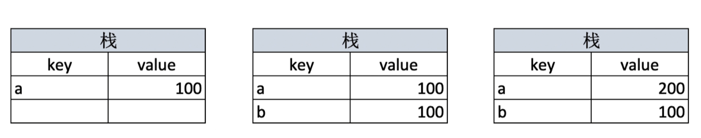
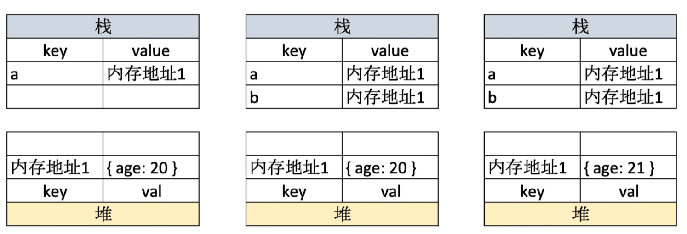

## 基础数据类型

在 js 中，数据类型可以分为以下 7 种

- number
- string
- boolean
- symbol
- null
- undefined
- object

其中，object 是复杂类型数据，包含了 array, function, date 等类型。

## 值类型与引用类型

##### 值类型

什么是值类型呢？ 大白话就是，简单类型的数据，大都是值类型。比如说类似这样

```javascript
let a = 100;
let b = a;
a = 200;
console.log(b); // 100
```

##### 引用类型

引用类型，大白话就是，复杂类型的数据，比如 object， 直接看例子吧

```javascript
let a = { age: 20 };
let b = a;
b.age = 21;
console.log(a.age); // 21
```

对象 `a` 赋值给 `b`，当 `b` 里面更改属性 `age` 的值，`a`的 `age` 属性也被改变了。

变量，是存储在栈里面的，先看一张图



简单类型的数据，在栈里面存储，key 就是变量名，value 就直接是具体的值，当 a = 100 的时候， a 的 value 就是 100， 当 b = a 的时候， b 的 value 就直接等于 100，所以当我们修改 a 的时候， b 的 value 还是 100

那么，复杂类型的数据，就是引用类型，为什么叫引用类型呢？看图吧



引用类型的数据，当 a = {age: 20} 的时候，会在堆里面生成一个内存地址，把 {age: 20} 放在堆里面。这个时候栈里面的变量 a 的值，其实是一个内存地址，这个内存地址指向对象 {age: 20}，当 b = a 的时候，其实是给 b 赋值了一个内存地址，b 的 value 也是一个内存地址，这时候 a 和 b 的值都是同一个内存地址，无论谁修改了属性值，内存地址指向的对象都会被修改。

为什么引用类型的数据要存储在堆里面，并给出一个内存地址呢？ 当然是因为性能的问题咯，复杂类型的数据有可能会很大的，如果直接存值，复制的时候就会很慢，值类型的数据一般都比较小比较简单。

至此，引用类型和值类型的区别就很明显了，因为有引用类型，所以才会有深拷贝之类的工具方法，具体怎么实现，其实就是不断的去判断类型，不是引用类型的数据就拷贝赋值，以此递归的循环。

常见的值类型一般都是简单的数据类型，`number` `string` `boolean` `symbol` `undefined`

常见的引用类型 `object` `array`  
`null`: 特殊的引用类型，指针指向空地址。  
`function`：也是特殊的引用类型，但是是一段可执行代码，一般不用于存储数据，所以几乎没有说拷贝函数、复制函数这种说法吧，反正按引用类型和值类型来说，应该是归类到引用类型的。
