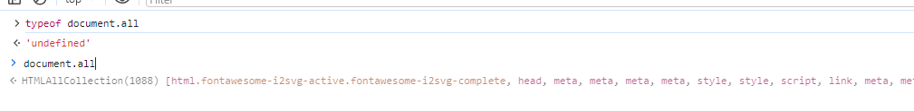
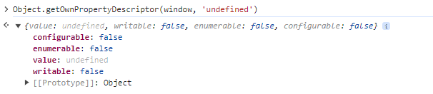

有了数据类型，那么在使用中就肯定需要判断当前变量是什么类型的, 为此介绍几种判断数据类型的常用方法。

## typeof

typeof 谁人不知，只能识别基础数据类型和引用类型，部分引用类型的进一步判断需要其他方法辅助。

```javascript
console.log(typeof { name: 'longlong' }); // object
```

需要注意几个值：  
`null` => object  
`NaN` => number  
`document.all` 返回当前页面所有节点，用 typeof 去判断会得到一个 `undefined`, 这个玩意它其实不是 web 标准，但是各大浏览器都支持。这个最早要从 IE 浏览器说起，这也是当年判断是否是 IE 浏览器常用的方法，IE10 以前通过 typeof 判断得到的都还是一个 object, 感兴趣可以自己去查一下。



## Object.prototype.toString.call

通过函数动态 this , 返回其数据类型。

```javascript
console.log(Object.prototype.toString.call('1')); // [object String]
console.log(Object.prototype.toString.call([])); // [object Array]
console.log(Object.prototype.toString.call({})); // [object Object]
console.log(Object.prototype.toString.call(new Date())); // [object Date]
console.log(Object.prototype.toString.call(false)); // [object Boolean]
console.log(Object.prototype.toString.call(1)); // [object Number]
console.log(Object.prototype.toString.call(new Error())); // [object Error]
```

这里有一个非常有意思的东西， toString 读取的数据类型，其实是可以定义的，看例子

```javascript
class MyTest {
  get [Symbol.toStringTag]() {
    return 'MyTest';
  }
}

const test = new MyTest();
console.log(Object.prototype.toString.call(test)); // [object MyTest]
```

通过 `get` 标识符 `[Symbol.toStringTag]` 可以自定义返回类型，toString 会去读取这里返回的自定义类型。

## constructor

constructor 指向创建实例对象的构造函数。

值得注意的是：`null` `undefined` 没有构造函数。并且 constructor 是可以被改写的。

所以这个方法一般用于辅助方法，配合其他方法一起使用。

```javascript
String.prototype.constructor = function a() {
  return {};
};

console.log('a'.constructor); // [Function: a]
```

虽然这种情况很少，几乎不会出现，但是需要注意，它并不是绝对安全的。

## instanceof

就是原型链上查找，查到就是其实例。

```javascript
console.log([] instanceof Array); // true
```

需要注意的是，instanceof 右操作数必须是一个 class 或者是一个函数，在**多窗口**，或者**跨窗体**的时候，它可能是不准确的。

## isPrototypeOf

`isPrototypeOf` 是 Object 原型上的方法, 用于测试一个对象是否存在于另一个对象的原型链上。

```javascript
const a = { name: 'longlong' };
console.log(Object.prototype.isPrototypeOf(a)); // true
```

## 其他有意思的判断

`undefined`  
undefined 其实早期的 IE 里面，是可以直接修改的，当然现代浏览器改不了，大概 IE8 的时候，还是可以被直接修改的，所以没记错的话，以前对于 `undefined` 的判断很多都会通过 `void 0` 来判断。

```javascript
console.log(undefined === void 0); // true
```

现代浏览器为什么不能修改了呢，直接看图吧



`undefined` 在现代浏览器里面是不可配置，不可枚举，不可改写的。
