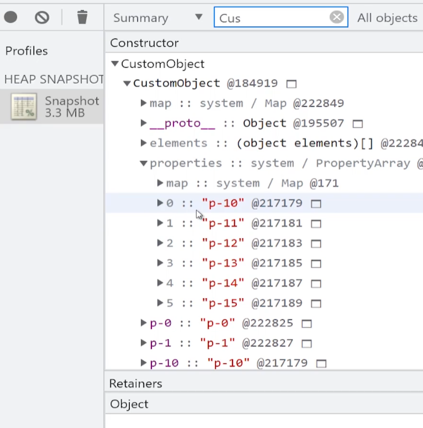
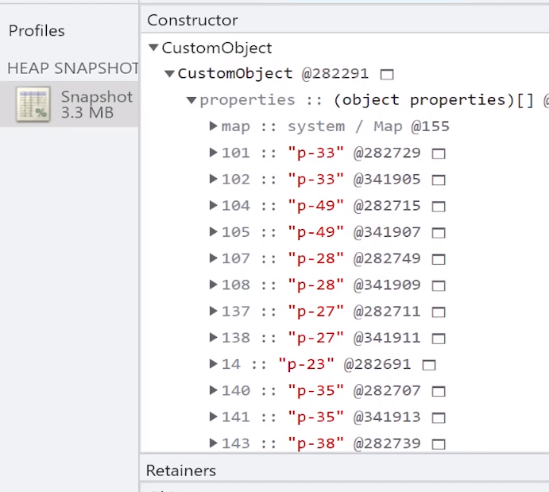
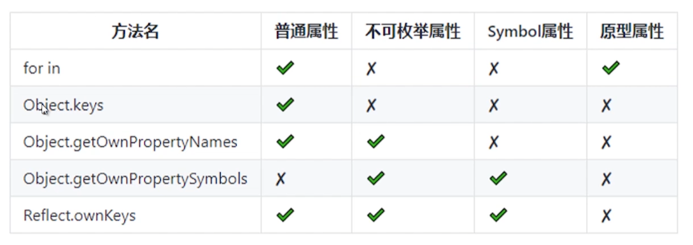

这篇文章通过介绍对象的排序属性、普通属性、隐藏类来提升对象属性的认知。

## 排序属性

排序属性在迭代器里会被优先遍历，当 **数字** 或者 **字符串数字** 作为 key 的时候，就是排序属性。_并且排序属性会按照索引值大小升序排序_。

```javascript
const obj = {};
obj[3] = '3';
obj[1] = '1';
obj['4'] = '4';
obj['2'] = '2';

for (const k in obj) {
  console.log(k);
}
// 1
// 2
// 3
// 4
```

## 普通属性

普通属性的 key 就是字符串做为 key

## 排序属性和普通属性的区别

其实在 V8 中，对象是有两个隐藏属性的，分别是 `elements` 和 `properties`

其中 `elements` 指向的就是排序属性， `properties` 指向普通属性。

为什么要这么设计呢，当然是为了属性的访问速度。

当访问对象属性的时候，V8 会先遍历 `elements` 从里面读取，再遍历 `properties` 读取。

那么这个时候，还是需要遍历 `elements` 和 `properties` 才能获取属性，V8 为了更快的访问对象的属性，还提供一个 **对象内属性** 的属性。

**`对象内属性`**：就是被保存到对象自身的常规属性，数量限制为 10 个，超过 10 个，会被保存到 `properties` 上。



通过快照可以看见，当普通属性超过 10 个之后，剩下的就会被存放到 `properties` 里。并且是 **通过下标有序排序的**。

但是当继续增加普通属性的数量的时候



当 `properties` 里面的普通属性达到一定数量的时候，有序就变成了无序了。

## 隐藏类

这玩意，就是截图里面的 map ,每当删除、添加属性时，会破坏隐藏类，隐藏类里面保存一些可复用的内容，比如属性的配置。

这个东西了解就好，目前也不知道怎么很好的通过文字的形式写下来，后续再说吧。

## 属性来源

- 静态属性：Object.assign, 不需要实例化就可以获取。

- 原型属性：Object.prototype.toString, 属性来源不是本身，而是原型上的属性。

- 实例属性：实例自身的属性。

```javascript
class Person {
  constructor(name, age) {
    // 实例属性
    this.name = name;
    this.age = age;
  }
  // 实例属性
  getName = () => {
    return this.name;
  };
  // 原型属性
  getAge() {
    return this.age;
  }
}

const person = new Person();

console.log(Object.hasOwnProperty.call(person, 'name')); // true
console.log(Object.hasOwnProperty.call(person, 'getName')); // true
console.log(Object.hasOwnProperty.call(person, 'getAge')); // false
```

## 属性访问控制 Object.defineProperty

`Object.defineProperty` 相信很多人都了解过吧，Vue2 响应性数据就是通过 `Object.defineProperty` 实现的。

先看看怎么使用吧， `Object.defineProperty` 接受一个要配置的对象，以及指定的属性，还有属性描述符三个参数，直接看代码吧

```javascript
const obj = { name: 'longlong' };

// 第一个参数为要配置的对象
// 第二个参数是指定的属性
// 第三个参数为属性的描述符
Object.defineProperty(obj, 'name', {
  value: 'lwt', // 属性值, 默认 undefined
  writable: true, // 是否可写，默认 false, 为 false 的时候，属性值不可修改
  configurable: true, // 是否可配置, 默认 false,  列如删除之类的
  enumerable: true, // 是否可枚举, 默认 false, 比如 for in  Object.keys 之类的循环

  // 访问器函数
  get() {
    return '567';
  },

  set(val) {
    value = val;
  },
});
```

> [!warning]
> 上面代码是为了展示所有属性，但是通常来说，`writable` 和 `value` 是一对，`get` `set` 访问器函数是一对，这两队是互斥的。

通常属性描述符的配置分为两种:  
**数据属性**：value + writable + configurable + enumerable 组合的配置。  
**访问器属性**：get + set + configurable + enumerable 组合。

`configurable: false` 的小特性  
1、当 `configurable` 为 false 不可配置时，除了 `writable` 和 `value` 其他的属性配置都不能修改, 但是可以修改 `writable` 和 `value`  
2、但是 `writable` 的修改 只能从 true => false 不能从 false => true ，只能从可写改为只读

`Object.defineProperty` 的缺点：

- 无法监听数组变化
- 只能监听指定属性，如果属性还是对象的话，还需要递归。

**Object.getOwnPropertyDescriptor** 获取属性配置
当想要查看对象上某个属性的配置的时候，可以通过 `Object.getOwnPropertyDescriptor` 来获取配置信息。

```javascript
console.log(Object.getOwnPropertyDescriptor(obj, 'name'));
// { value: 'lwt', writable: true, enumerable: true, configurable: true }
```

## 对象的扩展性 Object.preventExtensions

`Object.preventExtensions` ：对象不可扩展，也就是永远无法添加新的属性了。  
`Object.isExtensible` 判断对象是否可扩展，true: 可扩展 false: 不可扩展。

```javascript
const obj = { name: 'lwt' };
// 禁止扩展
Object.preventExtensions(obj);
// 可以修改值
obj.name = 'wlp';
// 无法添加新属性
obj.sex = 'man';
// 但是可以删除属性
delete obj.name;
console.log('obj', obj);
// {}
console.log(Object.isExtensible(obj));
// true
/**
 * Object.preventExtensions
 * 1、不能添加新属性
 * 2、可以删除现有属性
 * 3、属性可配置
 * 4、可以修改值
 * */
```

## 对象的封闭 Object.seal

`Object.seal` 封闭对象, 阻止添加新属性 + 属性标记为不可配置。  
`Object.isSealed` 检查对象是否被封闭，true: 封闭 false: 没封闭。

```javascript
const obj = { name: 'lwt' };
// 封闭对象
Object.seal(obj);
// 无法添加新属性
obj.sex = 'man';
// 无法删除属性
delete obj.name;
// 可以修改值
obj.name = 'wlp';
console.log('obj', obj);
// obj { name: 'wlp' }
console.log(Object.isSealed(obj));
//true
/**
 * Object.seal
 * 1、不能添加新属性
 * 2、无法删除属性
 * 3、属性不可配置
 * 4、可以修改值
 * */
```

## 对象的冻结 Object.freeze

`Object.freeze` 冻结对象, 不可添加新属性 + 不可配置 + 不可修改值  
`Object.isFrozen` 检查对象是否冻结，true: 冻结 false: 没冻结

```javascript
const obj = { name: 'lwt' };
// 冻结对象
Object.freeze(obj);
// 无法添加新属性
obj.sex = 'man';
// 无法删除属性
delete obj.name;
// 不可以修改值
obj.name = 'wlp';
// 无法修改配置 Cannot redefine property: name
Object.defineProperty(obj, 'name', {
  writable: true,
});
console.log('obj', obj); // obj { name: 'lwt' }
console.log(Object.isFrozen(obj)); // true
/**
 * Object.freeze
 * 1、不能添加新属性
 * 2、无法删除属性
 * 3、无法修改配置
 * 4、不可以修改值
 **/
```

## 属性遍历

说了这么多属性的知识，实际使用其实很少，属性的遍历才是经常会用到的。

对象的属性有几种:

- 普通属性： 普通的字符串属性，实例上的属性。
- 不可枚举属性： 通过 `defineProperty` 配置为不可枚举的属性，或者自身原型上的属性 比如 `toString` 之类的。
- 原型属性: 通过继承之类的。
- Symbol 属性
- 静态属性

遍历方法：

- fro in
- Object.keys
- Object.getOwnPropertyNames
- Object.getOwnPropertySymbols
- Reflect.ownKeys

其实平时用的最多的就是 `for in` 和 `Object.keys` 了，`Reflect.ownKeys` 也可以了解一下，挺有用的，其他的看看这个表，大概有个概念就行了。


