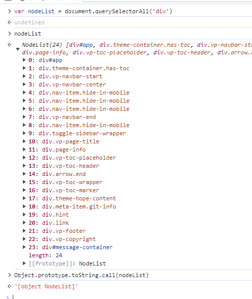
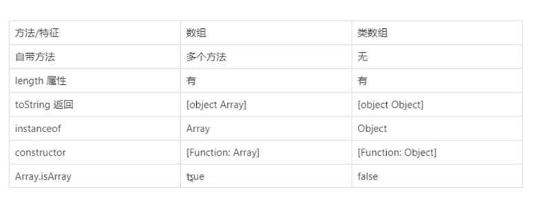

类数组是有一个 `length` 属性和 从零开始索引的属性，但是没有 Array 的内置方法的一种特殊对象。

## 类数组的特征

类数组是一个普通对象, 必须有 length 属性，可以有非负整数索引, 本身不具备数组所具备的方法。

## 常见的类数组

#### arguments

```javascript
function person(name, age, sex) {
  console.log('person arguments: ', arguments);
  console.log(
    'person arguments type: ',
    Object.prototype.toString.call(arguments)
  );
}
person('name', 'age', 'sex');
// person arguments:  [Arguments] { '0': 'name', '1': 'age', '2': 'sex' }
// person arguments type:  [object Arguments]
```

#### DOM 相关



获取的 DOM 节点，有 `length` , 有下标，但是类型不是一个数组, 也不具有数组上的方法，就是一个标准的类数组。

## 类数组转数组的几种方法

#### Array.prototype.slice.call

```javascript
const arrayLikeObj = {
  length: 2,
  0: '0',
  1: '1',
};

console.log(Array.prototype.slice.call(arrayLikeObj)); // [ '0', '1' ]
```

#### Array.prototype.concat.apply

```javascript
const arrayLikeObj = {
  length: 2,
  0: '0',
  1: '1',
};

console.log(Array.prototype.concat.apply([], arrayLikeObj)); // [ '0', '1' ]
```

#### Array.from

```javascript
const arrayLikeObj = {
  length: 2,
  0: '0',
  1: '1',
};

console.log(Array.from(arrayLikeObj)); // [ '0', '1' ]
```

#### Array.apply

```javascript
const arrayLikeObj = {
  length: 2,
  0: '0',
  1: '1',
};

console.log(Array.apply([], arrayLikeObj)); // [ '0', '1' ]
```

## 类数组和数组的区别


