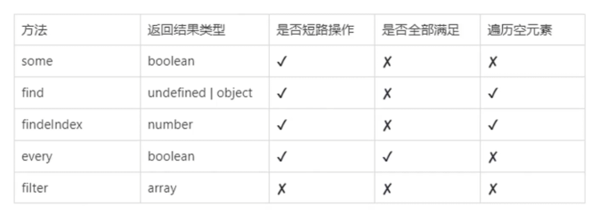

## 数组基础知识

#### 创建数组的几种方式

数组对象字面量：

```javascript
const arr = [];
```

`new Array`: 只有一个参数的时候，如果不是数值就作为成员，如果是在合理范围内的数值，则作为数组的长度。

```javascript
const arr = new Array('10');
console.log(arr); // [ '10' ]
```

`Array.from`

```javascript
const arr = Array.from({ length: 2 }, (item, index) => {
  return index;
});
console.log(arr); // [ 0, 1 ]
```

#### 长度与元素

```javascript
const arr1 = [1]; // 这样的一个逗号，表示后面还可以继续输入
const arr2 = [1, ,]; // 两个逗号中间，会表示一个空元素
const arr3 = new Array(10); // 当参数为数字时 会是数组的长度
const arr4 = new Array('10'); // 不是数组 就会作为一个元素

console.log(arr1.length); // 1
console.log(arr2.length); // 2
console.log(arr3.length); // 10
console.log(arr4.length); // 1
```

> [!warning]
> 数组不会自动向前一行代码添加分号, 以 `( [ + - /` 作为一行代码开头的时候，很可能会产生意外的情况，最好在前面加上分号，或者在上一行代码末尾加上分号。

```javascript
const a = { name: 'lwt' }
['name'];
console.log(a); // lwt
// 数组不会向前一行代码添加分号，等同于 const a = { name: 'lwt' }['name']
```

## 空元素

`empty`: 数组的空位，指数组的某一位置没有任何值，简单来说，就是数组上没有对应的属性。  
针对 **一般的遍历**，自动跳过空位， `forEach` `reduce` `map` 等。  
当 **基于值进行运算**，空位的值作为 `undefined`, 比如 `find` `findIndex` `includes` 等, 但是 `indexOf` 除外。  
当 **作为迭代**的时候，比如 `...` 扩展运算符 `for of` 等，也是 `undefined`。  
在 `join` 和 `toString` ，空元素视为一个空字符串。

```javascript
const arr = [1, , 3];
console.log(arr);
// [ 1, <1 empty item>, 3 ]

// 一般的遍历
arr.forEach((item, i) => {
  console.log(i + '=====' + item);
});
// 0=====1
// 2=====3
// 没有输出空元素 一般的遍历 直接跳过空元素

// 当基于值运算的时候
const index = arr.findIndex((item) => item === undefined);
console.log(index); // 1
// 当基于值运算的时候 会作为 undefined

console.log('join', arr.join(','));
// 1,,3 作为一个空字符串
```

## 稀疏数组

有空位元素的数组，就是稀疏数组。稀疏数组的访问会比较慢，一般情况下我们要避免创建稀疏数组。

#### 避免创建稀疏数组的三种常用方法

`Array.apply` `[...new Array(3)]` `Array.from`

```javascript
console.log(Array.apply(null, Array(3)));
console.log([...new Array(3)]);
console.log(Array.from(Array(3)));
// [ undefined, undefined, undefined ]
// [ undefined, undefined, undefined ]
// [ undefined, undefined, undefined ]
```


## indexOf 与 includes

#### indexOf
`indexOf` 返回一个 `number` , 查询元素在数组内的下标。但是无法查找到数组里面的 `NaN` `empty`。

#### includes 
`includes` 返回一个布尔值。数组包含查询元素返回 `true`，否则返回 `false`。能查询到数组内空元素、`NaN`。

```javascript
const arr1 = [1, , 3]
console.log('indexOf empty', arr1.indexOf(undefined)) // -1
console.log('includes empty', arr1.includes(undefined)) // true

const arr2 = [NaN]
console.log('indexOf NaN', arr2.indexOf(NaN)) // -1
console.log('includes NaN', arr2.includes(NaN)) // true

const arr3 = [undefined]
console.log('indexOf undefined', arr3.indexOf(undefined)) // 0
console.log('includes undefined', arr3.includes(undefined)) // true
// indexOf 无法查找到 NaN 和 空元素
// includes 都能查找到。
```

## 数组可变长度问题
`length` 代表数组中元素个数，数组额外附加属性不计算在内。   
`length` 是可写的，可以通过修改 `length` 改变数组长度。   
数组操作不存在越界，找不到下标，返回 `undefined`  

```javascript 
const arr = [1, 2, 3]
arr[10] = 10
console.log(arr, arr.length)
// [ 1, 2, 3, <7 empty items>, 10 ] 11
// 直接给下标10赋值，数组长度变为 11 ，中间的都为空元素

arr['a'] = 11
console.log(arr.length) // 11
// 添加额外的属性，数组长度不会变化

arr.length = 3
console.log(arr.length) // 3
// length 是可写的 可以直接改写 length 改变数组长度

console.log(arr[1000]) // undefined
// 访问不存在的下标返回 undefined
```

## 会改变自身的方法
- pop
- shift
- splice
- unshift
- push
- sort
- reverse
- copyWith
- fill

以上方法会改变数组自身，在使用的时候需要注意。

还有一个有趣并且可能值得注意的就是 `sort` 排序方法了，看一段代码。

```javascript 
const arr = [1, 2, 3, 4, 5, 6, 7, 8, 9, 10]
arr.sort()
console.log(arr)
// [ 1, 10, 2, 3, 4, 5,  6, 7, 8, 9]
// 10 会排在 2 前面， 因为 10 它会先取 1 去计算 ASII 码
console.log('10'.charCodeAt()) // 49
console.log('1'.charCodeAt()) // 49
```

## 其他注意事项

#### 数组线性存储
默认情况下，数组是线性存储，它的下标是有序的。如果跨越了下标直接赋值，会产生空元素，并且下标会变成无序的非线性存储。所以为了提高数组的访问速度和性能，**尽量的线性递增**。

#### delete 误区
`delete` 不会改变数组长度, 被删除的元素，会变成一个空元素。
```javascript 
const arr1 = [1, 2, 3, 4]
delete arr1[1]
console.log(arr1, arr1.length)
// [ 1, <1 empty item>, 3, 4 ]   4
```

#### push vs concat
`push` 会改变原数组, `concat` 会产生一个新数组, 在进行数据的大量操作复制的时候， `push` 的性能会好很多。

#### 数组的查找和过滤方法



这里了解方法之间的区别就行。
