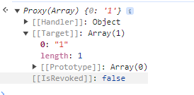

本篇主要介绍数组里面一些使用场景和一些其他的知识。可看可不看，影响不大。

## Array.isArray

`Array.isArray` 是个前端应该都知道。判断传入的是否是一个数组。

```javascript
const arr = [];
console.log(Array.isArray(arr)); // true
```

那么当它被 `Proxy` 代理之后呢？

```javascript
const arr = [];
const proxy = new Proxy(arr, {});
console.log(Array.isArray(proxy)); // true
```

但是为什么被代理之后判断的结果是正确的呢，proxy 应该是一个代理对象，看看代码吧

```javascript
const arr = [];
const proxy = new Proxy(arr, {});
console.log(Array.isArray(proxy)); // true

// 先看看 proxy 的原型链 是不是等于数组的原型
console.log(proxy.__proto__ === Array.prototype); // true

// proxy instanceof 判断 看是不是一个数组
console.log(proxy instanceof Array); // true

// 再看看 Proxy 是啥
console.log(Object.prototype.toString.call(Proxy)); // [object Function]
// 再看看 Proxy 的原型
console.log(Proxy.prototype); // undefined
```

看完代码，`Proxy` 是一个函数，并且它是 **没有原型的** , 并且它不会改变代理对象的外在表现，所以 `Array.isArray(proxy)` 得到的是 `true`。

其实 `Array.isArray` 在协议中的说明是，当传入的对象是一个 `Proxy` 对象，就会从 `ProxyTarget` 里面取值，再进行判断。



## Array.prototype.entries

`entries()` 方法返回一个新的数组迭代器对象，该对象包含数组中每个索引的键/值对。

```javascript
const arr = [1, undefined, null, {}, 'longlong'];

console.log(arr.entries()); // Object [Array Iterator] {}

const iter = arr.entries();
console.log(iter.next()); // { value: [ 0, 1 ], done: false }
// value 是一个数组，第一项是下标，第二项是值, done 表示是否是最后一个，是否迭代完了。

for (const [i, v] of arr.entries()) {
  console.log(i, v);
}
// 0 1
// 1 undefined
// 2 null
// 3 {}
// 4 longlong
```

迭代器，感觉平时实际开发的场景也用的少，其实就是返回一个对象，里面提供一个 `next` 方法，如果需要适用于 `for of` 的话，需要额外提供一个 `[Symbol.iterator]` 的属性，想了解更多可以自己去搜一下相关知识。
