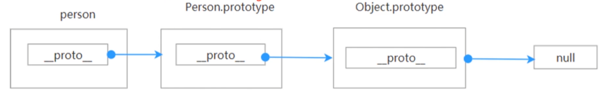
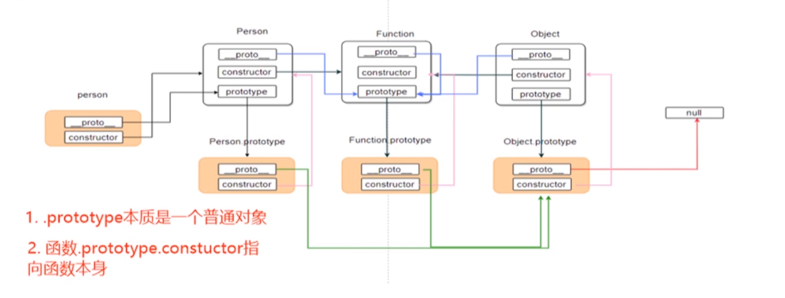

## 原型链

先看一个例子：

```javascript
const obj = {};
console.log(obj.toString); // [Function: toString]
```

`obj` 对象上没有定义 `toString` ，但是还是访问到了，这是因为，它访问一个实例自身不存在的属性的时候，会去原型上找。也就是会去 `obj.__proto__` 上找。`__proto__` 是构造函数的原型，所以 `obj.__proto__` 就是 `Object.prototype`，`Object.prototype` 上有 `toString` 方法，所以这里 `obj.toString` 能访问，这就是原型链。

这里来验证一下 `obj.__proto__` 是不是等于 `Object.prototype`。

```javascript
const obj = {};
console.log(obj.__proto__ === Object.prototype); // true
```

得到得的答案是符合预期的，普通对象的 `__proto__` 是等于构造函数的 `prototype` 的。

再看一个例子

```javascript
function Person(name) {
  this.name = name;
}
Person.prototype.getName = function () {};
const person = new Person('lwt');

// 原型链部分
console.log(person.__proto__ === Person.prototype); //true
console.log(Person.prototype.__proto__ === Object.prototype); //true
console.log(Object.prototype.__proto__ === null); //true
```

在这个例子里面:

先看原型链的部分

1. `person.__proto__ === Person.prototype` 为 `true`，是因为 `__proto__` 是构造函数的原型, person 的构造函数是 Person, 所以 `person.__proto__ = Person.prototype`。
2. `prototype` 是一个普通对象，普通对象的 `__proto__` 是构造函数的原型, 所以 `Person.prototype.__proto__ = Object.prototype`
3. `Object.prototype.__proto__ = null`, 是特殊的 定死的, 也可以说是原型链的尽头了。



用一张流程图能更好的表达出来。



这个图，更加清晰的表述了原型链的一个关系。

> [!important]
> 牢记 `prototype` 本质上是一个对象，对象上的 `__proto__` 都会指向它的构造函数的 `prototype`。

例如：一个普通对象 person 的 `__proto__` 指向的就是 `Object.prototype`，而 `Object.prototype.__proto__ = null`， 所以说普通对象祖上两代就是 `null`, `{}.__proto__.__proto__ = null`

而一个普通函数, `fn.__proto__` 指向 `Function.prototype`，`Function.prototype`是一个对象，`Function.prototype.__proto__` 指向 `Object.prototype`，`Object.prototype.__proto__ = null`，所以普通函数祖上三代是 `null`, 也就是 `fn.__proto__.__proto__.__proto__ = null`

原型是有点绕，文字也不好表达，所以看完，再去看两个流程图，自己从头到尾的走一遍，理解一遍，应该就能懂了。

## 继承

个人理解，继承是基于原型链实现的，也就是说，要实现继承，就往原型链上添加需要继承的属性和方法就好了。

看代码

```javascript
function Person(name) {
  this.name = name;
}
Person.prototype.getName = function () {};
const person = new Person('lwt');

console.log(person.name); // lwt
console.log(person.getName); // [Function (anonymous)]
```

向构造函数 `Person` 的原型上添加了一个方法 `getName`， 实例对象 `person` 也能直接调用到，这个就是从原型链上去找了。也可以说是 `person` 继承了 `getName` 这个方法。

#### class 继承

ES6 的 class 也经常会用来继承, 也直接看代码吧，了解继承的方法就行，都是应用了原型链的原理。

```javascript
class Parent {
  constructor() {}

  parentFn() {
    console.log('parent fn');
  }
}

class Child extends Parent {
  constructor() {
    super();
  }

  childFn() {
    console.log('child fn');
  }
}

const child = new Child();
child.parentFn(); // parent fn
```
