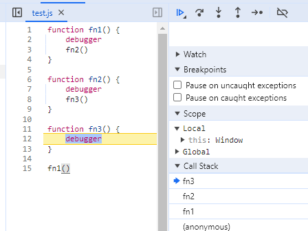

## 执行栈

执行栈（也有叫调用栈的）是一种拥有后进先出数据结构的栈，被用来储存代码运行时创建的所有执行上下文。



通过截图可以看见，执行栈里面，先被调用的会先加进去，后被调用的在上面，执行结束，会被弹出执行栈。用数组来展示说明可能会更好：

```javascript
// 执行栈 后进先出
CallStack = [];
// 调用 fn1 ，添加进执行栈
CallStack = ['fn1'];
//调用 fn2  添加进执行栈
CallStack = ['fn2', 'fn1'];
//调用 fn3  添加进执行栈
CallStack = ['fn3', 'fn2', 'fn1'];
// 当 fn3 执行结束 把 fn3 弹出执行栈
CallStack = ['fn2', 'fn1'];
// 继续执行 fn2 ，当 fn2 执行结束，弹出 fn2
CallStack = ['fn1'];
// 继续执行 fn1 当 fn1 执行结束，弹出 fn1，执行栈清空，执行结束
CallStack = [];
```

当然，调用栈也是有最大限制的，目前谷歌浏览器测试最大栈为 10465，所以有时候写递归方法的时候要谨慎，不然一不小心就会爆栈，直接给浏览器卡转圈。

## 作用域

一个独立的区域，主要作用就是隔离变量。可以分为三种： 全局作用域，函数作用域，块作用域(ES6)。作用域在创建的时候就已经确定，是静态的。

作用域有个重要概念，叫 **作用域链**：作用域也可以根据代码层次分层，以便子作用域可以访问父作用域，而不能从父作用域引用子作用域中的变量和引用。  
其实和原型链很像，就是当前作用域里没有，就往外去找，看个例子：

```javascript
// 全局作用域 找到了，就使用它
const globalName = 'longlong';

function test() {
  // 在函数作用域里面也没找到，就再往外找
  const name = 'lwt';
  {
    // 块级作用域没有 就往外去找
    console.log(globalName);
  }
}

test(); // longlong
```

当然作用域是不能从外往里找的，父作用域是无法访问子作用域的。

```javascript
function test() {
  console.log(name);
  {
    const name = 'longlong';
  }
}

test(); // name is not defined
```

作用域在函数创建的时候就确定了的。所以分析作用域，可以直接看函数创建的时候，不用看具体什么时候调用。

## 变量提升

个人理解，变量提升就是访问“后”申明的变量，也就是在变量被定义之前访问。

```javascript
console.log(a); // undefined
var a = 1;
// 这里等同于 var a
// 然后在给 a 赋值 a = 1
```

> [!important]
> 变量提升，只有使用 `var` 来定义变量的时候才会出现。

## 暂时性死区

使用 ES6 `let` 和 `const` 变量显示赋值之前不能对变量进行读写，否则会报错。

```javascript
console.log(a); // undefined
var a = 1; // 使用 var 会出现变量提升，不会报错

console.log(b); // Cannot access 'b' before initialization
let b = 2; // const 和 let 定义的变量，在定义之前使用，会报错
```

## 闭包

闭包这玩意，实际开发中使用的频率应该算是比较高的，而且面试也总有人问。

个人理解的闭包就是：内部函数访问了上层作用域链中的变量对象。并且闭包一旦使用了上层作用域的变量，就会导致变量无法被回收。

看个经典闭包，这个也经常在面试题里面出现：

```javascript
for (var i = 0; i < 3; i++) {
  setTimeout(() => {
    // 使用了上层作用域里面的 i
    console.log(i);
  }, 0);
}
// 3
// 3
// 3
```

这个面试题很有意思的，看看解决办法：

```javascript
// 第一种 使用 let
for (let i = 0; i < 3; i++) {
  setTimeout(() => {
    console.log(i);
  }, 0);
}
//   0
//   1
//   2

// 第二种 setTimeout 的第三个参数
for (var k = 0; k < 3; k++) {
  setTimeout(
    (k) => {
      console.log(k);
    },
    0,
    k
  );
}
//   0
//   1
//   2

// 还可以使用 IIFE (立即调用函数表达式) 个人感觉写起来不好看 就不写了 知道就行了
```

## IIFE (立即调用函数表达式)

了解一下几种写法就好了，在以前用 jq 的时代经常这么会用到，就我个人来说，现在貌似都很少用到了, 只有一些特殊情况才会用到。

```javascript
;(function (a,b) {
	console.log(a + b)
})(1, 2);

(function (a, b){
	console.log(a + b)
}(1, 2));

void function (a, b) {
	console.log(a + b)
}(1,2);

// 3
// 3
// 3
```
