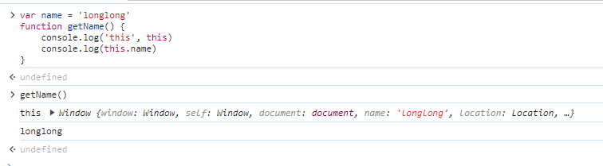
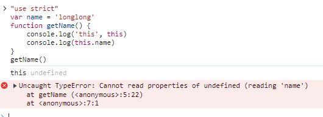

`this` 只要是个前端都知道吧。而且都知道函数执行的时候， `this` 的指向是动态的。

## this 是什么

`this` 是执行上下文 `global`、`function` 或 `eval` 的一个属性，在非严格模式下，总是指向一个对象，在严格模式下可以是任意值。

#### 执行上下文

简单介绍一下执行上下文吧，执行上下文就是 `JavaScript` 代码被解析和执行的环境，执行上下文里包含了 `this`, 变量环境: `var`, 词法环境: `let const`, 外部环境。执行上下文在运行的时候才会创建，并且是动态的。

#### this 的绑定规则：

- 默认绑定
- 隐式绑定
- 显示绑定
- new
- 箭头函数

## 默认绑定

#### 非严格模式

浏览器环境：`this` 指向 `window`。



`nodejs` 环境: `this` 指向 `global` 对象

```javascript
var name = 'longlong';
function getName() {
  console.log('this', this);
  console.log(this.name);
}
getName();
// this Object [global]
// undefined
```

#### 严格模式

浏览器环境和 nodejs 环境 `this` 都是指向 `undefined`。

浏览器环境：



nodejs 环境：

```javascript
'use strict';
var name = 'longlong';
function getName() {
  console.log('this', this);
}

console.log('global this', this); // global this {}

getName();
// undefined
```

## 隐式绑定

作为某个对象的属性被调用的时候。

```javascript
function test() {
  console.log(this.name);
}

const obj = {
  name: 'longlong',
  test,
};
const obj2 = {
  name: 'lwt',
  test,
};

obj.test(); // longlong
obj2.test(); // lwt
```

从打印的结果来看，谁调用，`this` 就指向谁，多级嵌套也同样如此。

```javascript
function test() {
  console.log(this.name);
}

const obj = {
  name: 'longlong',
  test,
  obj2: {
    name: 'lwt',
    test,
  },
};

obj.test(); // longlong
obj.obj2.test(); // lwt
```

## 显示绑定

就是字面意思，显示表达谁是 `this`。

#### Function.prototype.call

```javascript
function test() {
  console.log(this.name);
}

const obj = {
  name: 'longlong',
};

test.call(obj); // longlong
```

#### Function.prototype.apply

```javascript
function test() {
  console.log(this.name);
}

const obj = {
  name: 'longlong',
};

test.apply(obj); // longlong
```

#### Function.prototype.bind

`bind` 和 `call` `apply` 有点区别，它返回的是一个函数，不会立即执行，需要我们自己手动调用一下。

```javascript
function test() {
  console.log(this.name);
}

const obj = {
  name: 'longlong',
};

const bindTest = test.bind(obj);
bindTest(); // longlong
```

`bind` 可以多次绑定 但是只会对第一个生效

```javascript
const obj = { name: '张三' };
const obj2 = { name: '李四' };
const bindLogName2 = logName.bind(obj).bind(obj2);
bindLogName2();
// name: 张三
// this { name: '张三' }
```

`bind` 还可以额外的传参，就是调用的时候继续传入参数。

```javascript
function add(num1, num2, num3, num4) {
  return num1 + num2 + num3 + num4;
}
const bindAdd = add.bind(null, 10, 20);
console.log(bindAdd(30, 40));
// 100
```

#### 属性绑定符

绑定符是 ES 高级特性里的，因为目前还需要 babel 去转换才能运行，这里参照 TC39 给出的例子展示一下代码，了解一下就行了。

```javascript
function test() {
  console.log(this.name);
}

const obj = {
  name: 'longlong',
};

(obj)::test();
// 等同于 test.call(obj)
```

## new

实例化一个函数或者 ES6 的 class 也会改变 `this` 指向。

```javascript 
function Person(name) {
	this.name = name
	this.getName = function () {
		return this.name
	}
}
const person = new Person('lwt')
console.log(person.getName())
// lwt
```

对于 `Function`, `return` 会影响返回值。`return` 非对象，实际返回系统内部的对象。`return` 对象，实际返回该对象。

```javascript 
function Fn1() {
	this.name = 'Fn1'
}
function Fn2() {
	this.name = 'Fn2'
	return {
		name: 'change name'
	}
}
function Fn3() {
	this.name = 'Fn3'
	return undefined
}
console.log(new Fn1()) // Fn1 { name: 'Fn1' }
console.log(new Fn2()) // { name: 'change name' }
console.log(new Fn3()) // Fn3 { name: 'Fn3' }
```
`new` 做了什么事情呢：

1. 创建一个空对象
2. 设置空对象的原型
3. 执行构造函数方法，把相关的属性和方法添加对象上
4. 返回对象，如果构造函数返回的值是对象类型，就直接返回该对象，否则返回第一步创建的对象

这里也是大概了解就行，有兴趣深入了解自己百度吧，就不写例子了。

## 箭头函数

没有自己的 `this` , `arguments`, `super`, `new.target`, 特别适合需要匿名函数的地方，但是不能用于构造函数，箭头函数的 `this` 是继承于上层作用域的 `this`。

```javascript 
const name = 'wlp'
const getName = () => this.name

const personArrow = {
	name: 'personArrow name',
	getName: () => this.name
}

const personArrow2 = {
	name: 'personArrow2 name',
	getName() {
		return {
      getName: () => this.name
    }
	}
}

// 浏览器中执行
console.log(getName()) // wlp
console.log(personArrow.getName()) // wlp
console.log(personArrow2.getName()()) // personArrow2 name
```

箭头函数是可以嵌套的, `this` 会一层一层的继承。

```javascript 
class Arrow {
	constructor(name) {
		this.name = name
	}
	getName() {
		return {
			getName2: () => ({
				getName3: () => ({
					getName4: () => this.name
				})
			})
		}
	}
}
const arrow = new Arrow('arrow')
console.log(arrow.getName().getName2().getName3().getName4())
// arrow
```

箭头函数的 `this` 是继承于上层作用域的 `this`，并且 `this` 是动态的，如果上层 `this` 发生改变，箭头函数里的 `this` 也会跟着改变。
