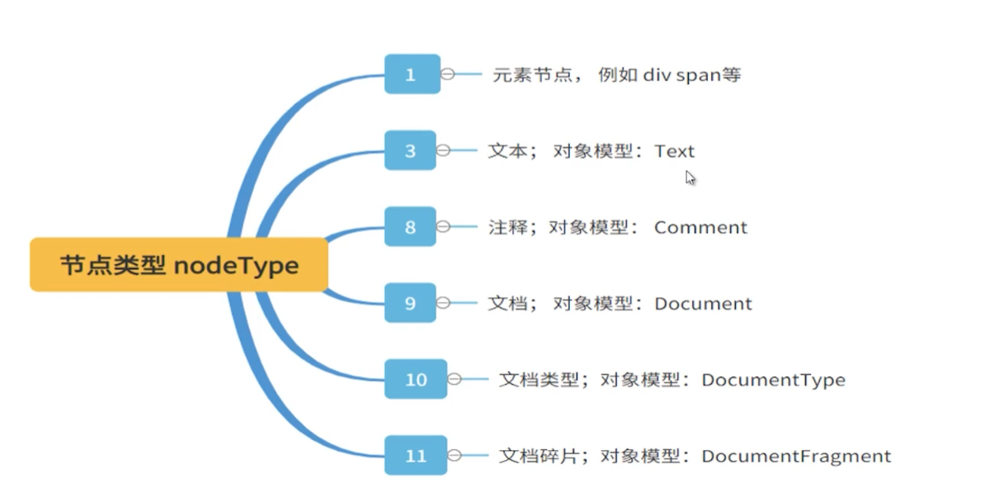
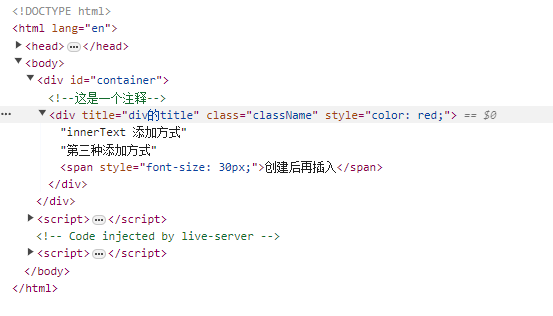

在 Vue React 盛行的时代，如果不使用框架，还能操作 DOM 不？

## NodeType

节点类型 NodeType , 直接贴图吧：



::: sandpack#vue DOM 操作示例

@file index.vue

```vue
<script setup>
import { ref, onMounted } from 'vue';

onMounted(() => {
  // 容器
  const container = document.getElementById('container');

  // 创建注释节点
  const comment = new Comment('这是一个注释');
  container.appendChild(comment);

  // 创建 div
  const divEl = document.createElement('div');
  // 属性赋值
  divEl.setAttribute('title', 'div的title');
  // 设置class
  divEl.className = 'className';
  // 设置行内样式
  divEl.style.color = 'red';
  // 添加内容
  divEl.innerText = 'innerText 添加方式';
  divEl.appendChild(new Text('第三种添加方式'));

  // 或者先创建一个标签, 设置好属性之后再插入
  const spanEl = document.createElement('span');
  spanEl.textContent = '创建后再插入';
  spanEl.style.fontSize = '30px';

  // 再插入到 div 里面
  divEl.appendChild(spanEl);

  // 最后，添加 div 到容器里面
  container.appendChild(divEl);
});
</script>

<template>
  <div id="container"></div>
</template>
```

:::

这个示例感觉看起来效果不是很好，还是把代码贴出来吧

```html
<!DOCTYPE html>
<html lang="en">
  <head>
    <meta charset="UTF-8" />
    <meta name="viewport" content="width=device-width, initial-scale=1.0" />
    <title>Document</title>
  </head>
  <body>
    <div id="container"></div>

    <script>
      // 容器
      const container = document.getElementById('container');

      // 创建注释节点
      const comment = new Comment('这是一个注释');
      container.appendChild(comment);

      // 创建 div
      const divEl = document.createElement('div');
      // 属性赋值
      divEl.setAttribute('title', 'div的title');
      // 设置class
      divEl.className = 'className';
      // 设置行内样式
      divEl.style.color = 'red';
      // 添加内容
      divEl.innerText = 'innerText 添加方式';
      divEl.appendChild(new Text('第三种添加方式'));

      // 或者先创建一个标签, 设置好属性之后再插入
      const spanEl = document.createElement('span');
      spanEl.textContent = '创建后再插入';
      spanEl.style.fontSize = '30px';

      // 再插入到 div 里面
      divEl.appendChild(spanEl);

      // 最后，添加 div 到容器里面
      container.appendChild(divEl);
    </script>
  </body>
</html>
```



可以看见，注释节点，和 div 的一些相关的配置也都生效了。

## XML

如何处理 XML，使用 `DOMParser`

```javascript
// 处理 XML
// XMLDocument
const parser = new DOMParser();
const xmlDoc = parser.parseFromString(
  `
    <xml>
        <persons>
            <name>张三</name>
            <age>20</age>
        </persons>    
        <persons>
            <name>李四</name>
            <age>22</age>
        </persons>  
    </xml>
`,
  'text/xml'
);

// 先查询所有 persons 的节点，就是数据包裹的节点
const persons = xmlDoc.querySelectorAll('persons');
console.log(persons); // NodeList(2) [persons, persons]

// 得到的 person 是一个类数组，可以先转为一个数组，再去循环
const personsJSON = Array.from(persons).map((node) => {
  console.log(node.querySelector('name')); // <name>李四</name>
  console.log(node.querySelector('name').childNodes); // NodeList [text]
  console.log(node.querySelector('name').childNodes[0].nodeValue); // 李四
  return {
    name: node.querySelector('name').childNodes[0].nodeValue,
    age: node.querySelector('age').childNodes[0].nodeValue,
  };
});

console.log(personsJSON);
// [{"name":"张三","age":"20"},{"name":"李四","age":"22"}]
```

## DocumentFragment

`DocumentFragment`, DOM 片段，就像标准的 document 一样，存储由节点组成的文档结构，所有的操作会被一次插入到文档中，而这个操作仅发生一个重新渲染的操作。常用于大批量的创建大量节点，提高性能。

```html
<!DOCTYPE html>
<html lang="en">
  <head>
    <meta charset="UTF-8" />
    <meta name="viewport" content="width=device-width, initial-scale=1.0" />
    <title>Document</title>
  </head>
  <body>
    <div id="container"></div>
    <button id="fragmentBtn">片段插入</button>
    <button id="appendBtn">直接插入</button>

    <script>
      // 批量模拟数据
      const items = Array.from({ length: 10000 }, (v, i) => {
        return {
          name: 'name' + i,
          age: i,
          sex: i % 2,
        };
      });

      // 容器
      const container = document.getElementById('container');

      // 直接插入
      function createByS() {
        console.time('createByS');
        items.forEach((item) => {
          const divEl = document.createElement('div');
          divEl.innerHTML = `name: ${item.name} - age: ${item.age}`;
          container.appendChild(divEl);
        });
        console.timeEnd('createByS');
      }

      // 通过文档片段插入
      function createByB() {
        console.time('createByB');
        const fragment = document.createDocumentFragment();
        items.forEach((item) => {
          const divEl = document.createElement('div');
          divEl.innerHTML = `name: ${item.name} - age: ${item.age}`;
          fragment.appendChild(divEl);
        });
        container.appendChild(fragment);
        console.timeEnd('createByB');
      }

      const fragmentBtn = document.getElementById('fragmentBtn');
      fragmentBtn.addEventListener('click', createByB);
      // createByB: 74.380859375 ms

      const appendBtn = document.getElementById('appendBtn');
      appendBtn.addEventListener('click', createByS);
      // createByS: 79.628173828125 ms
    </script>
  </body>
</html>
```

虽然时间上没少太多，但是也是证明了， fragment 片段插入的方式，性能上是比直接插入的方式要好的。
