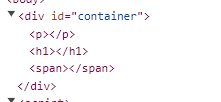
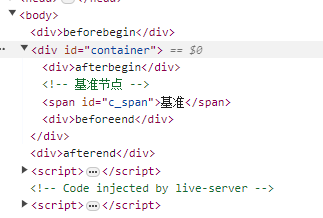

## 创建

挂载一个节点，肯定需要先创建一个节点，简单介绍一下创建节点的方式。

#### 对象模型直接 `new`

```javascript
const comment = new Comment('注释');
const text = new Text('文本');
```

#### document.create 系列

```javascript
const divEl = document.createElement('div');
const commentNode = document.createComment('注释');
const textNode = document.createTextNode('文本');
```

## 挂载

#### Node API

- `appendChild` : 将一个节点附加到指定父节点列表的末尾
- `insertBefore` : 再参考节点之前插入一个拥有指定父节点的子节点
- `replaceChild` : 指定的节点替换当前节点的一个子节点，并返回被替换的节点
- `textContent` : 一个节点及其后代的文本内容

```html
<div id="container">
  <span id="c_span">基准</span>
</div>

<script>
  // 容器
  const divEl = document.getElementById('container');
  // 基准节点
  const c_span = document.getElementById('c_span');

  //  span
  const spanEl = document.createElement('span');
  // 将 span 插入末尾
  divEl.appendChild(spanEl);

  //  p
  const pEl = document.createElement('p');
  // 再基准标签前插入
  divEl.insertBefore(pEl, c_span);

  // h1
  const h1El = document.createElement('h1');
  // 用 h1 替换基准标签
  divEl.replaceChild(h1El, c_span);

  // divEl.textContent = 'textContent'
  // textContent 会直接覆盖 div 里的内容
</script>
```



#### Element API

- `after` : 在该节点之后插入一组 Node
- `before` : 在该节点之前插入一组 Node
- `append` : 在节点最后一个子节点后插入一组 Node
- `prepend` : 在节点的第一个子节点之前插入一组 Node
- `insertAdjacentElement` : 将节点插入给定的一个位置
- `insertAdjcentHTML` : 将文本解析为节点插入给定的位置
- `insertAdjcentText` : 将文本节点插入到给定的位置
- `replaceChildren` : 将后代替换为指定节点
- `replaceWith` : 将后代替换为指定节点集合

这里就介绍几个比较需要注意的

#### insertAdjacentElement 系列的

`insertAdjacentElement` 系列的，有四个位置参数可选。

- `afterbegin` : 在标签开始之后插入
- `afterend` : 在标签结束之后插入
- `beforebegin` : 在标签开始之前插入
- `beforeend` : 在标签结束之前插入

```html
<div id="container">
  <!-- 基准节点 -->
  <span id="c_span">基准</span>
</div>

<script>
  // 容器
  const divEl = document.getElementById('container');

  function createDiv(content) {
    const divEl = document.createElement('div');
    divEl.innerHTML = content;
    return divEl;
  }

  // 以自身为定位标准
  // 在标签开始之后插入
  divEl.insertAdjacentElement('afterbegin', createDiv('afterbegin'));
  // 在标签结束之后插入
  divEl.insertAdjacentElement('afterend', createDiv('afterend'));
  // 在标签开始之前插入
  divEl.insertAdjacentElement('beforebegin', createDiv('beforebegin'));
  // 在标签结束之前插入
  divEl.insertAdjacentElement('beforeend', createDiv('beforeend'));
</script>
```



> [!warning] > `insertAdjacentElement` 系列的指定位置插入，是以自身为基准去确定位置的。  
> `insertAdjcentHTML` `insertAdjcentText` 也是一样的，只是传入的参数不同而已。

#### replaceWith 和 replaceChildren

`replaceWith` 和 `replaceChildren` 都是全面替换子节点，参数是多个节点或者字符串。

其他常用的方法就不做介绍了，不是很了解就自己代码试试，有的方法其实看命名就能看出来什么意思的，对吧。

## 删除节点

#### 单个删除

- `Node.removeNode`
- `Element.remove`
- `outerHTML | innerHTML`
- `Document.adoptNode`

#### 批量删除

- `replaceChildren` 和 `replaceWith`
- 循环使用单个删除的方法删除

## 节点克隆

#### Node.cloneNode

克隆节点，分为浅克隆和深克隆

#### Document.importNode

从外部文档引入节点，可引入节点的后代节点。源节点被保留。

#### Document.adoptNode

从其他文档获取节点，节点和后代节点会从源节点删除。

#### Element.innerHTML

把 A 节点的 innerHTML 赋值给 B 节点的 innerHTML 也可以实现克隆。

> [!tip]
> 节点复制不能复制 DOM2 的事件，一定程度上能复制 DOM0 级别的事件。  
> `importNode` 和 `adoptNode` 虽然描述上是从外部文档引入节点，其实在同文档里面操作也能生效。
