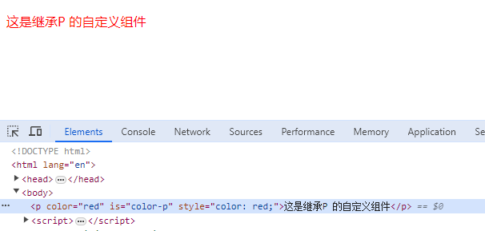
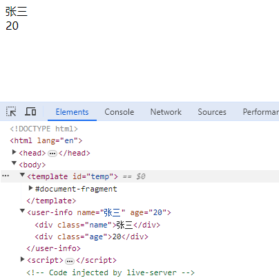
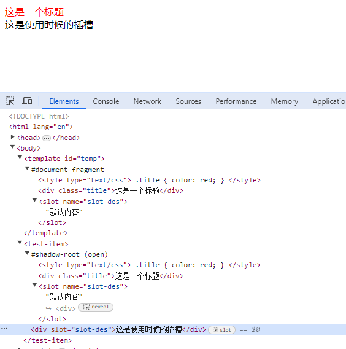

## 基础了解

Web Component 使用步骤

- 编写 Web Component 组件
- 注册 Web Component 组件
- 使用

```html
<!DOCTYPE html>
<html lang="en">
  <head>
    <meta charset="UTF-8" />
    <meta name="viewport" content="width=device-width, initial-scale=1.0" />
    <title>Document</title>
  </head>
  <body>
    <!-- 使用 -->
    <my-text></my-text>

    <script>
      // 编写组件
      class MyText extends HTMLElement {
        constructor() {
          super();
          this.append('我的文本');
        }
      }

      //   注册组件
      window.customElements.define('my-text', MyText);
    </script>
  </body>
</html>
```

## Custom elements 自定义元素

> [!important]
> 自主定制元素：是独立的元素，不继承其他内建的 HTML 元素，可以直接把它写成 HTML 标签的形式，来在页面上使用。例如上面基础的例子 `<my-text>`

> 自定义内置元素：继承自基本的 HTML 元素，指定所需扩展的元素。使用时，需通过 is 属性指定 custom element 的名称。

```html
<!-- 添加 color 属性，方便自定义组件取值。   使用 is 指定使用自定义组件的名称。 -->
<p color="red" is="color-p">这是继承P 的自定义组件</p>

<script>
  // 继承自 P 标签的自定义组件
  class ColorP extends HTMLParagraphElement {
    constructor() {
      super();
      // 取标签属性 color 的值，添加到样式里面
      this.style.color = this.getAttribute('color');
    }
  }
  // 注册的时候，会多传一个配置项，里面添加继承配置 extends: 'p'
  window.customElements.define('color-p', ColorP, { extends: 'p' });
</script>
```



> [!warning]
> 节点用 `is` 指定 `name`。其必须包含一个短横线，所以 `<my-text>` `<color-p>` 是合法的 `name`。而如果是 `<text>` 或者 `<colorP>` 则不行。

#### 生命周期

- `connectedCallback` : 插入文档时
- `disconnectedCallback` : 从文档删除时
- `adoptedCallback` : 被移动新文档时
- `attributeChangedCallback` : 属性变化时

如果把组件使用放在注册的后面，是不会生效的，例如：

```html
<script>
  // 编写组件
  class MyText extends HTMLElement {
    constructor() {
      super();
      this.append('我的文本');
    }
  }

  //   注册组件
  window.customElements.define('my-text', MyText);
</script>

<!-- 使用 -->
<my-text></my-text>
```

经过查找资料，最佳实践是在生命周期 `connectedCallback` 里面去操作 DOM

```html
<!-- 使用 -->
<my-text></my-text>

<script>
  // 编写组件
  class MyText extends HTMLElement {
    constructor() {
      super();
    }
    connectedCallback() {
      this.append('我的文本');
    }
  }

  //   注册组件
  window.customElements.define('my-text', MyText);
</script>

<!-- 使用 -->
<my-text></my-text>
```

## HTML template HTML 模板

#### 配合 Custom element 使用

配合 Custom element 使用，可以增加复用性，看起来是不是有点组件的感觉了：

```html
<template id="temp">
  <div class="name"></div>
  <div class="age"></div>
</template>

<user-info name="张三" age="20"></user-info>

<script>
  class UserInfo extends HTMLElement {
    constructor() {
      super();
    }
    connectedCallback() {
      // 获取 template 里面的内容，并且拷贝
      const content = document.getElementById('temp').content.cloneNode(true);
      this.append(content);
      // 获取当前组件上的属性值，并且赋值给拷贝过来的节点的文本内容
      this.querySelector('.name').innerText = this.getAttribute('name');
      this.querySelector('.age').innerText = this.getAttribute('age');
    }
  }
  window.customElements.define('user-info', UserInfo);
</script>
```



#### slot 插槽的概念

想要插槽生效，就不能直接 `append` ，需要使用 `Shadow DOM` 来进行 `append`。

```html
<template id="temp">
  <!-- 还可以添加样式 -->
  <style type="text/css">
    .title {
      color: red;
    }
  </style>
  <div class="title">这是一个标题</div>
  <!-- 这里是插槽 -->
  <slot name="slot-des">默认内容</slot>
</template>

<test-item>
  <!-- 使用的时候 -->
  <div slot="slot-des">这是使用时候的插槽</div>
</test-item>

<script>
  class TestItem extends HTMLElement {
    constructor() {
      super();
    }
    connectedCallback() {
      // 获取 template 里面的内容，并且拷贝
      const content = document.getElementById('temp').content.cloneNode(true);
      // this.append(content)
      // 如果需要插槽生效，不能直接 append ，需要使用 Shadow DOM 影子DOM
      const shadow = this.attachShadow({ mode: 'open' });
      shadow.append(content);
    }
  }
  window.customElements.define('test-item', TestItem);
</script>
```



## Shadow DOM 影子 DOM

这里做一些简单介绍。

首先，Shadow DOM 内部样式不共享，具有隔离性。其次，内部元素是否可以被外部访问，取决于 `mode` 配置。

`mode`: `open` | `closed`

`open`: Shadow root 元素可以从 js 外部访问根节点。  
`closed`: 拒绝从 js 外部访问关闭的 Shadow root 节点。
