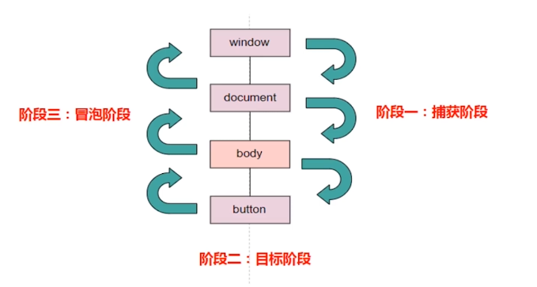

## DOM0 事件

DOM 0 级的事件是什么呢，直接看代码吧：

```html
<button onclick="console.log('按钮被点击了')"></button>
```

这就是 DOM 0 级事件，直接通过 onclick 绑定。

#### DOM 0 级事件的优点：

- 效率高，直接绑定。
- 节点上 `onclick` 属性被 `Node.cloneNode` 克隆的时候，能够一定程度的克隆，但是通过 JS 动态绑定的就不行。
- 移除事件简单，直接 `.click = null `
- 兼容性好

#### DOM0 事件的注意事项

- 事件处理函数中，this 是当前的节点
- 如果调用的是一个函数，会再全局作用域查找
- 唯一性，只能定义一个事件回调函数

```html
<!-- 可以是字符串 -->
<button onclick="console.log('按钮被点击了')">字符串</button>
<!-- log: 按钮被点击了 -->

<!-- 可以是一个函数，会在全局作用域查找 -->
<button onclick="clickFn1()">是一个函数</button>
<!-- log: click fn 1 -->

<!-- this 指向自身 -->
<button class="showThis" onclick="console.log(this, this.className)">
  this 指向自身
</button>
<!-- log:     <button class="showThis" onclick="console.log(this, this.className)">this 指向自身</button>, showThis -->

<!-- 全局作用域没有的方法 -->
<button onclick="clickFn2()">全局作用域没有的方法</button>
<!-- log： clickFn2 is not defined -->

<script>
  function clickFn1() {
    console.log('click fn 1');
  }

  ;(function () {
    function clickFn2() {
      console.log('click fn 2');
    }
  })();
</script>
```

## DOM2 事件

话不多说，先看看图。



#### 事件注册 addEventListener

`target.addEventListener(type, listener, useCaptrue | options)`       
`type`: 事件类型。 `listener`：注册函数。    
`useCaptrue`：`true` => 捕获阶段传播到目标的时候触发。 反之冒泡阶段传到目标的时候触发。 默认值 `false`, 冒泡时触发。

```html 
 <button id="btn">点击</button>

    <!-- 捕获: window
    捕获: document
    捕获: btn
    冒泡: btn
    冒泡: document
    冒泡: window
    捕获: window
    捕获: document
    冒泡: document
    冒泡: window -->

    <script>
        window.addEventListener('click', function() {
            console.log('捕获: window');
        }, true)

        document.addEventListener('click', function() {
            console.log('捕获: document');
        }, true)

        btn.addEventListener('click', function() {
            console.log('捕获: btn');
        }, true)

        btn.addEventListener('click', function() {
            console.log('冒泡: btn');
        })

        document.addEventListener('click', function() {
            console.log('冒泡: document');
        })

        window.addEventListener('click', function() {
            console.log('冒泡: window');
        })
    </script>
```

#### options.once

是否只响应一次。

```html 
<button id="btn">点击</button>

<script>
    btn.addEventListener('click', function() {
        console.log('冒泡: btn');
    }, {once: true})
</script>
```

点击第一次后，不会再进行响应。

#### options.passive

设置为 `true` 时，事件处理成不会调用 `preventDefault()`。

经典使用为处理滚动性能：
```javascript 
const elem = document.getElementById('elem')
elem.addEventListener('touchmove', function() {
  // do something
}, { passive: true })
```

#### options.useCaptrue

如果这个参数相同，并且事件的回调函数也相同，事件不会被添加。

## event.preventDefault()

阻止默认行为，比如 a 标签点击不跳转等。但是事件依然会继续传播。

## event.stopPropagation()

阻止捕获和冒泡阶段中当前事件的进一步传播。

常用于阻止事件冒泡，其实不止可以阻止冒泡，也可以阻止捕获。

```javascript 
window.addEventListener('click', function(e) {
    // e.stopImmediatePropagation() 
    // 写在这里，事件将不在往下传递，按钮点击只会输出 捕获: window
    console.log('捕获: window');
}, true)

document.addEventListener('click', function() {
    console.log('捕获: document');
}, true)

btn.addEventListener('click', function() {
    console.log('捕获: btn');
}, true)

btn.addEventListener('click', function() {
    console.log('冒泡: btn');
    // e.stopImmediatePropagation() 
    // 写在这里，事件冒泡停止传递，后面的监听冒泡事件都不会被触发
})

document.addEventListener('click', function() {
    console.log('冒泡: document');
})

window.addEventListener('click', function() {
    console.log('冒泡: window');
})
```

## target 和 currentTarget

`target`: 触发事件的元素。
`currentTarget`: 绑定事件的元素。

```html 
<button id="btn">点击</button>

<script>
    document.addEventListener('click', function(e) {
        console.log(e.target);
        console.log(e.currentTarget);
    })

    // <button id="btn">点击</button>
    // #document
</script>
```

## DOM3 事件

DOM3 事件在 DOM2 事件的基础上重新定义了事件，并且添加了新的事件类型。

1. 用户界面事件(UIEvent): 涉及与 BOM 交互的通用浏览器事件。
2. 焦点事件(FocusEvent): 在元素获得和失去焦点时触发。 focus | blur
3. 鼠标事件(MouseEvent): 使用鼠标在页面上执行某些操作的时候触发。
4. 滚轮事件(WheelEvent): 使用鼠标滚轮时触发。
5. 输入事件(InputEvent): 向文档中输入文本时触发。
6. 键盘事件(KeyboardEvent): 使用键盘在页面上执行某些操作的时候触发。 keydown | keypress


## 自定义事件

#### new Event

`event = new Event(type, eventInit)`

`type`: 事件类型。   
`eventInit.bubbles`: 是否冒泡。    
`eventInit.cancelable`: 是否能被取消。
`eventInit.composed`: 是否会在影子DOM根节点之外触发侦听器。

#### new CustomEvent

`event = new CustomEvent(type, eventInit)`  

`type`: 事件类型。    
`eventInit.detail`: 事件参数。     
`eventInit.bubbles`: 是否冒泡。    
`eventInit.cancelable`: 是否能被取消。
