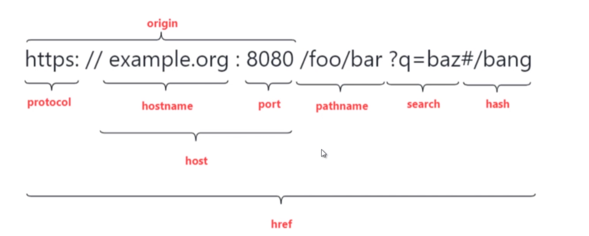

Location 对象的内容其实不多，大概的了解一下。

先看个 url 的拆解图。

## 修改属性值

`location.origin` 属性是只读的，存在兼容性问题。

除了 `hash` ，其他任意属性修改都会以新的 `url` 重新加载。修改这些属性值，会在浏览器的历史记录中生成一条新的记录。

修改 `pathname` 可以不用传 `/`, 修改 `search` 可以不用传 `?` ，修改 `hash` 可以不用传 `#` 。

## host 和 hostname

#### host 包含端口号

#### hostname 不包含端口号，只返回域名

#### 没有端口号的 url, 表现上 host 与 hostname 相同。

## window.location.reload

作用，重新加载当前文档。

参数：`false` 或者不传，浏览器可能从缓存中读取页面。 `true`, 强制从服务器重新下载文档。

## hash 的监听方式

1. `window.onhashchange = fn`
2. `window.addEventListener('hashchange', fn, false)`
3. `<body onhashchange="fn()">`
