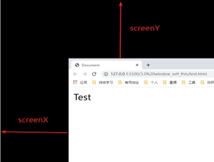
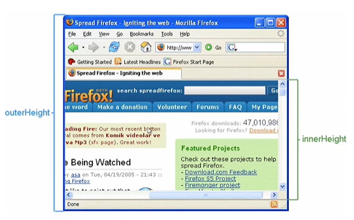
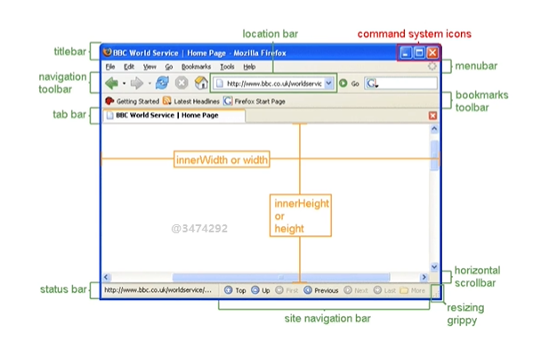

## window 对象

* 一个包含DOM文档的窗口，表示浏览器窗口以及页面可见区域。
* 一个全局变量，全局函数和变量都是它的属性。

## 关于 window.window

window 对象的 window 属性指向 window 对象本身。

```js 
window.window === window // true
window.window.window === window.window // true
```

这样的设计 主要是方便使用 this：

```js
// 全局作用域下
window === this // true
```

`this` 即是 `window` ，其有 `window` 属性: `this.window.window`

需要注意的是

```js 
this.window // window
window.this // undefined
```

## window.isSecureContext

`window.isSecureContext` 属性是一个只读属性，返回一个布尔值，表示当前环境是否安全。

很重要的一个表现就是当前网页是不是 https 协议的。

作用就是，有一些浏览器特性是只支持在安全的上下文里执行的。

例如： 

* Service Worker: 可以在离线的情况下为网页提供资源。
* Web Authentication API: 生物密码的一些认证，例如指纹、面部识别等。
...

还有很多，具体的 API 可以参考 MDN 文档 [仅限于安全上下文的特性](https://developer.mozilla.org/zh-CN/docs/Web/Security/Secure_Contexts/features_restricted_to_secure_contexts)


**安全的上下文**：

* 当前页面是 https 
* http 跳转到 https ，也是安全的上下文

**不安全的上下文**：

* 当前页面是 http
* https 里面使用 iframe 引入了 http 的内容。

>[!important]
> `http://127.0.0.1` 和 `http://localhost` 会认为是安全的上下文。


## 尺寸位置等属性

### screenX/screenY

`screenX` 和 `screenY` 属性返回浏览器窗口相对于屏幕左上角的水平距离和垂直距离。




### 尺寸

`innerWidth` 和 `innerHeight` 属性返回浏览器窗口的视口大小（视口不包括浏览器边框）。

`outerWidth` 和 `outerHeight` 属性返回浏览器窗口的外部大小（包括浏览器边框）。




其他的尺寸属性可以参考：




## print 打印

`window.print` 方法用于打开打印对话框，除了打印功能外，还允许用户更改页面打印的设置。

### 设置打印样式

* `@media print`：这是一个 CSS 媒体查询，用于定义只在打印时生效的样式规则。
* `page-break-before`、`page-break-after`、`page-break-inside`：这些属性用于控制分页行为。
* `visibility`、`display`：这些属性可以用于控制元素的可见性和显示方式。
* `@page`：这是一个 CSS 规则，用于定义打印页面的布局和尺寸。
* `margin`：这个属性可以用于设置打印页面的边距。
* `width`、`height`：这些属性可以用于设置打印页面的宽度和高度。

```css 
@media print {
  @page {
    size: A4 landscape;
    margin: 1cm;
  }
}
```

设置打印样式的几种方式：

```css
@media print {
  body {
    background-color: #fff;
    color: #000;
  }
  .hidden-print {
    display: none;
  }
}
```

```html
<style>
@media print {
  body {
    background-color: #fff;
    color: #000;
  }
  .hidden-print {
    display: none;
  }
}
</style>
```

```html
<link rel="stylesheet" href="print.css" media="print">
```

```css
@import url("print.css") print;
```


### 控制打印区域

指定打印区域，同样可以用样式控制。

在打印样式里，把不需要打印的样式全部隐藏掉。