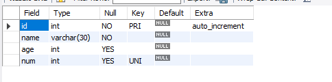
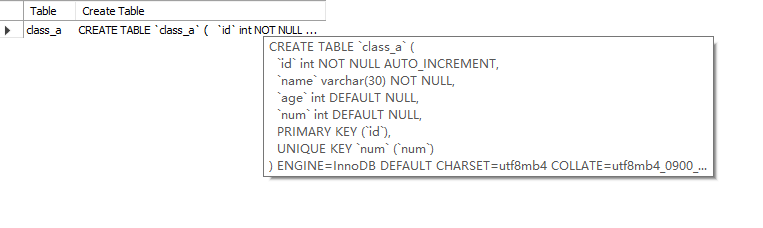

对于数据表来说，就直接的认为它就是一个表格，里面是存储多条数据。

这里拿学生表举例，需要的字段：

- id： 主键 primary key 一般都会是 id ，并且保证唯一性，让它自增。
- name: 名称，使用 NOT NULL 进行非空约束，毕竟重名很常见。
- age: 年龄
- num: 学号, 通过 UNIQUE 保证唯一性，不能重复设置。

## 创建

首先，看一下是否在 `school` 数据库下, 确保我们操作的是正确的数据库，

```shell
select database();
```

### 创建表

接着在 `school` 数据库下，根据上面设计的字段，创建一个名为 **class_a** 的表：

```shell
create table if not exists class_a(
	id int primary key auto_increment,
    `name` varchar(30) not null,
    age int,
    num int unique
);
```

执行语句，成功创建了 **class_a** 数据表。

### 查看表结构

执行:

```shell
desc class_a;
```



字段也是和我们设置的约束一样。

### 查看创建表的 sql 语句

执行: 

```shell
show create table class_a;
```



来查看创建表的 sql 语句。

### 以原表的结构为基础创建一个新表

以 **class_a** 表的结构为基础，创建一张新的表 **class_a_1** ，执行：

```shell
create table if not exists class_a_1 like class_a;
```

这种创建方式，结构和原表一模一样，但是数据不会复制过去。

### 以原表的内容为基础创建一个新表

执行：

```shell
create table if not exists class_a_2 select * from class_a;
```

这种方式，可以把内容复制过去，但是需要注意，主键之类设计的不会被应用到新表上。

### 以原表完整的创建一个新表

如果以一个原表为基础，我们想要结构完整，并且复制数据过来，可以这么做：

```shell
create table if not exists class_a_3 like class_a;
insert into class_a_3 select * from class_a;
```

先以原表的结构为基础，创建一个新表，然后把原表的数据，全部插入到新表中。

## 修改表

### 修改表名

```shell
alter table class_a_1 rename to class_a_name;
```

### 清空表内容且保留表结构

```shell
delete from class_a_3;
```

## 删除

删除一个表，直接执行:

```shell
drop table class_a_2;
```
