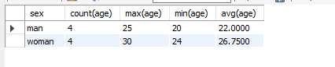

## 条件查询

例如，查询 `id = 4` 的信息条目, 使用 `where` 条件：

```shell
select * from class_a where id = 4;
```

例如，查询 **年龄大于18** 的数据:

```shell
select * from class_a where age > 18;
```

例如，查询 **年龄不等于18** 的数据:

```shell
select * from class_a where age != 18;
```

## 条件组合

当然条件可以组合起来, 例如查询 **年龄大于18 并且 id = 4** 的数据：

```shell
select * from class_a where age > 18 && id = 4;
# and 和 && 效果是一样的
select * from class_a where age > 18 and id = 4;
```

有 and 肯定就有 or：

```shell
select * from class_a where age > 18 || id = 4;
# or 和 || 效果是一样的
select * from class_a where age > 18 or id = 4;
```

## 区间值

例如查询 **年龄在18至25之间** 的值：

```shell
select * from class_a where age between 18 and 25;
```

## 指定值

例如查询 **年龄为18 20 25** 的值：

```shell
select * from class_a where age in (18, 20, 25);
```

## 是不是 null

例如查询 **年龄为null** 的数据:

```shell
select * from class_a where age is null;
# 不为 null
select * from class_a where age is not null;
```

## 模糊查询

`%` 表示匹配任意个任意字符， `_` 表示匹配任意一个字符, 例如查询 **name 中有李** 的数据:

```shell
select * from class_a where `name` like '%李%';
```

## 分页查询

`limit` 为查询多少条，`offset` 为偏移量：

```shell
# 第一页
select * from class_a limit 5 offset 0;
# 第二页
select * from class_a limit 5 offset 5;
```

也可以简写, `limit` 后面第一个是偏移量, 第二个是条数。

```shell
select * from class_a limit 0, 5;
select * from class_a limit 5, 5;
```


## 排序

### 升序排列

`asc` 表示升序。 例如，按照 **年龄升序** ：

```shell
select * from class_a order by age asc;
```

### 降序排列

`desc` 表示降序。 例如，按照 **年龄降序**：

```shell
select * from class_a order by age desc;
```

### 多个条件排序

如果有多个排序条件，逗号隔开，接着后面写。 例如 **年龄降序，学号升序**:

```shell
select * from class_a order by age desc, num asc;
```

## 最大值、最小值、平均值、求和、数量、数量去重

### 最大值

`MAX(字段名)` 来查询最大值，返回具体的值。例如，查询 **年龄的最大值**：

```shell
select max(age) from class_a;
# 返回具体的值 25
```

### 最小值

`MIN(字段名)` 来查询最小值，返回具体的值。例如，查询 **年龄的最小值**：

```shell
select min(age) from class_a;
# 返回具体的值 20
```

### 平均值

`avg(字段名)` 来查询最小值，返回具体的值。例如，查询 **年龄的平均值**：

```shell
select avg(age) from class_a;
# 返回具体的值 23.75
```

### 求和

`sum(字段名)` 来求和，返回具体的值。例如，查询 **年龄求和**：

```shell
select sum(age) from class_a;
# 返回具体的值 190
```

### 数量

`count(字段名)` 来查询有值的数量，返回具体的值。例如，查询 **年龄有值的条目数量**：

```shell
select count(age) from class_a;
# 返回具体的值 8
```

### 数量去重

`distinct` 关键字可以去重。例如，查询 **年龄不重复的数量**：

```shell
select count(distinct age) from class_a;
# 返回具体的值 2
```

## 分组查询

例如，我们添加一个性别的枚举，并且更新数据，添加性别数据：

```shell
alter table class_a add sex enum('man', 'woman');
update class_a set sex = 'man' where id < 7;
update class_a set sex = 'woman' where id >= 7;
```

此时通过 `group by`，我们根据性别分组查询数据:

```shell
select sex, count(age), max(age), min(age), avg(age) from class_a group by sex;
```


