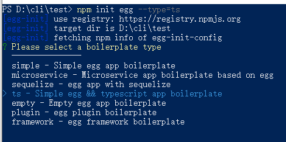
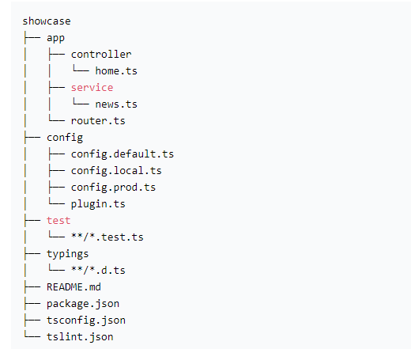
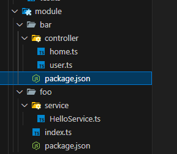

## 简介

首先，Egg 是基于 Koa 的。如果熟悉 Koa 就能够很快的上手。

Egg 奉行“约定优于配置”。按照一套统一的约定开发应用时，团队成员可以减少学习成本，不再是“钉子”，能流动起来。未有约定的团队，沟通成本极高，因为每个人的开发习惯可能都不同，容易犯错。但约定并不意味着扩展性差，Egg 的扩展性极高，可根据不同团队的约定来定制框架。

## 安装

因为我是使用 typescript 开发，这里介绍一下 ts 的模板项目：

```shell
# 创建一个项目文件夹
mkdir showcase && cd showcase
npm init egg --type=ts
npm i
npm run dev
```

这里直接 `npm install` 就好了，因为我在安装示例项目的时候，添加了淘宝源，结果报错了。

在写这篇文章安装实例项目的时候， `npm init egg --type=ts` 命令会让你选择：



直接选择 ts 的模板即可。

这里需要注意，如果你是新版，检查一下 `package.json` 里面是否开启了 `declarations` 配置，没有的话添加上，否则不会生产 `.d.ts` 定义文件:

```json
{
  "egg": {
    "typescript": true,
    "declarations": true
  }
}
```

[egg typescript](https://www.eggjs.org/zh-CN/tutorials/typescript) 可以去官网查看更多相关介绍。


## 目录规范

[项目目录规范](https://www.eggjs.org/zh-CN/basics/structure)

[typescript 相关目录规范](https://www.eggjs.org/zh-CN/tutorials/typescript#%E7%9B%AE%E5%BD%95%E8%A7%84%E8%8C%83)

ts 项目，会有个 `typings` 目录用于存放 `d.ts` 文件（大部分文件可以自动生成）。



关于目录具体介绍，可以查看官网。

但是在我实际创建实例项目的时候，我发现 egg 的模板更新了：



已经提供了各种装饰器了，看看 `app/module/bar/controller/home.ts` 文件:

```typescript
import { EggLogger } from 'egg';
import { Inject, HTTPController, HTTPMethod, HTTPMethodEnum } from '@eggjs/tegg';

@HTTPController({
  path: '/',
})
export class HomeController {
  @Inject()
  logger: EggLogger;

  @HTTPMethod({
    method: HTTPMethodEnum.GET,
    path: '/',
  })
  async index() {
    this.logger.info('hello egg logger');
    return 'hello egg';
  }
}
```

以前还是官网介绍的目录结构， app 下有 `router.ts`, `controller`, `service`。

不过怎么目录怎么样，使用什么样的方式，看哪种适合自己就好了，如果你熟悉 `nestjs` 框架，那么你肯定也熟悉这种新的模板。


## 必须了解的特性

简介里面介绍了，egg 的约定性很强。

所以，`app/controller` 里的所有控制器，和 `app/service`等，会自动注册到 app 实例里面。

并且，egg 添加了一些配置文件，可以配置一些内置的中间件等。

并且 egg 新增了 plugin 插件，可以在社区中获取很多别人封装好的优秀插件来协助我们完成业务开发。

## 其他

### 代码格式

因为有时候会使用一些占位变量，可能不会读取值，但是会写上，例如中间件的 optiosn 和 app 参数。

可以配置 `.eslintrc` :

```text
 "rules": {
    "@typescript-eslint/no-unused-vars": "off"
  }
```

`tsconfig.json` 中：

```text
"noUnusedLocals": false, /* 检查未使用的变量 */
"noUnusedParameters": false,/* 检查未使用的函数参数 */
```

### TS 类型定义

在使用 ts 的时候，如果增加了某些类型，例如新增了一个 model 的数据模型类型，typing 里面也生成定义文件，但是就是没有提示。

这个时候，可能需要我们手动的在 typing 下面建立一个 `index.d.ts` 文件。

以我新增的 `model/user.ts` 为例，这个时候，其实 `typing/app/model/index.d.ts` 已经有了定义文件，是自动生成的，
但是不知道为什么，好像没有正确的引入，导致代码里面并没有出现提示。

`typing/app/model/index.d.ts` 文件:

```typescript
// This file is created by egg-ts-helper@2.1.0
// Do not modify this file!!!!!!!!!
/* eslint-disable */

import 'egg';
import ExportUser from '../../../app/model/user';

declare module 'egg' {
  interface IModel {
    User: ReturnType<typeof ExportUser>;
  }
}
```

`typing/app/model/index.d.ts` 文件里面其实已经自动生成了类型定义，但是代码里没有提示

在 `typing/index.d.ts` 文件里面手动添加:

```typescript
import 'egg'

import {IModel} from './app'

declare module 'egg' {
    interface Application {
        model: IModel
    }
    interface Context {
        model: IModel
    }
}
```

同时挂载到 `app` 和 `ctx` 下。

当然这里只是举例，如果你是真的使用了 `egg-mongoose` 出现了类型定义的问题，那么你应该是重载 `MongooseModels`
这个类型：

```typescript
declare module 'egg' {
    interface MongooseModels extends IModel {
        [key: string]: Model<any>
    }
}
```
