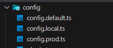

## 配置

在 egg 中，可以在配置中，配置中间件和插件等。配置分为默认配置和环境配置



这个配置是合并的，不同环境的配置，会覆盖重名的默认配置。

具体配置项还是需要看[官网配置介绍](https://www.eggjs.org/zh-CN/basics/config)

这里说一下，关于 ts 类型推断的问题，`config.default.ts` 里，返回的 `bizConfig` 业务属性的类型推断有点问题

解决方案就是, 给 config 做个类型断言

```typescript
return {
    ...(config as {}),
    ...bizConfig,
  };
```

## 扩展

扩展很简单，在 app 下创建一个 `extend` 文件夹，放置你要扩展的对象即可。

文件名对应需要扩展的对象。

[可扩展对象](https://www.eggjs.org/zh-CN/basics/extend)
