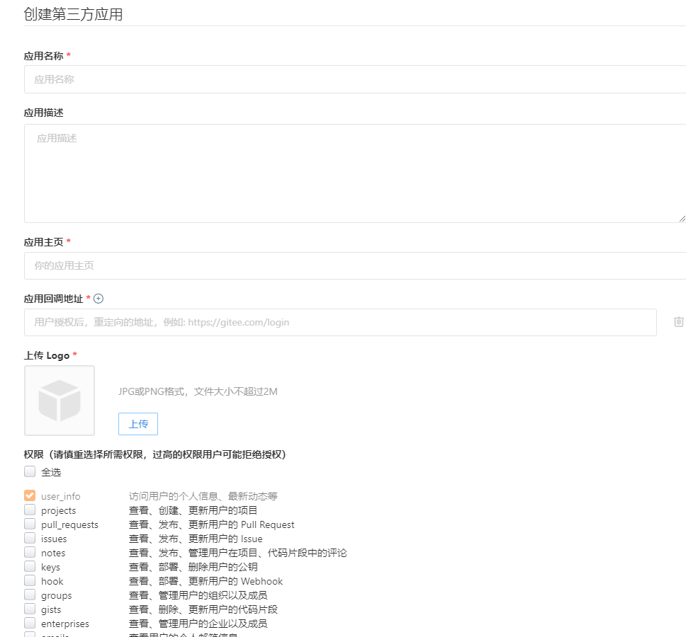

## 手机号验证码

手机验证码登录，需要用户传入自己的手机号，并且服务端生成一个验证码。

验证码一般是有时效的，比如说5分钟内有效，那么就需要一个地方来存储，并且还能有到期删除的能力。

这里首选肯定是 redis 了。关于 redis 的使用，后面单独整理一遍文章在数据库的系列里去细说。

### 配置 redis

在 egg 里面使用 redis，可以安装 `egg-redis` 插件：

```shell
npm install egg-redis
```

安装完成后在 `config/plugin.ts` 下配置 `redis` 插件：

```text
redis: {
    enable: true,
    package: 'egg-redis',
}
```

在 `config/config.default.ts` 配置 `redis` 的参数, 具体的环境参数根据开发和生产来配置:

```text
config.redis = {
    client: {
      port: 6379,
      host: 'redisHost',
      password: '',
      db: 0,
    },
};
```

使用也是很简单

```typescript
// 存入数据 键值对的方式 key value ex表示多少秒过期 px 表示多少分钟过期
await app.redis.set(`${phoneNumber}`, verifyCode, 'ex', 60);
// 获取数据
await app.redis.get(`${phoneNumber}`);
```

### 验证码

生成 **4位** 验证码:

```typescript
const verifyCode = Math.floor(Math.random() * 9000 + 1000).toString();
```

可以通过环境配置，是否使用短信服务发送验证码:

```typescript
 // 阿里云发送短信
if (app.config.env === 'prod') {
  const resp = await this.service.user.sendSMS(phoneNumber, verifyCode);
}
```

### 阿里云短信服务

在购买了短信服务和配置好资质和签名以及短信模板之后。

在短信服务的控制台，打开 **Open API 开发者门户**, 选择 SDK 示例。然后选择自己的开发语言，可以看见生成的示例代码，
我这里用的 ts ，所以拿 ts 来说。

首先安装阿里云提供的依赖, 一共两个 `@alicloud/dysmsapi20170525` 和 `@alicloud/openapi-client`

`@alicloud/openapi-client` 是阿里云服务的统一入口，没记错的话使用 OSS 的时候也需要这个包，这种设计挺好的，也许哪天有这种需求，可以借鉴一下。

```shell
npm install @alicloud/dysmsapi20170525
npm install @alicloud/openapi-client
```

安装完成之后，进入 `config/config.default.ts` 配置参数，具体环境自己根据配置来写:

```text
const aliCloundConfig = {
    accessKeyId: process.env.ALI_ACCESS_KEY_ID,
    accessKeySecret: process.env.ALI_ACCESS_KEY_SECRET,
    endpoint: 'dysmsapi.aliyuncs.com',
};
```

然后需要先去扩展一下 `app`，进入 `app/extend/application.ts`, 没有就创建。

```typescript
import { Application } from 'egg';
import Dysmsapi20170525 from '@alicloud/dysmsapi20170525';
import OpenApi, * as $OpenApi from '@alicloud/openapi-client';

const ALCLIENT = Symbol('Application#ALClient');

export default {

  get ALClient(): Dysmsapi20170525 {
    const that = this as Application;
    const { accessKeySecret, accessKeyId, endpoint } = that.config.aliCloundConfig;
    if (!this[ALCLIENT]) {
      const config = new $OpenApi.Config({
        accessKeySecret,
        accessKeyId,
      });
      config.endpoint = endpoint;
      this[ALCLIENT] = new Dysmsapi20170525(config);
    }
    return this[ALCLIENT];
  },
};
```

在 `app` 上挂载上阿里云服务的实例，然后就可以通过 `app` 直接访问到阿里云服务的实例并且发送短信了：

```typescript
const sendSMSRequest = new $Dysmsapi20170525.SendSmsRequest({
    phoneNumbers: phoneNumber,
    templateCode: 'templateCode',
    templateParam: `{"code":"${verifyCode}"}`,
    signName: 'signName',
});
const resp = await app.ALClient.sendSms(sendSMSRequest);
```

关于 AccessKey 可以看阿里云的文档[创建AccessKey](https://help.aliyun.com/zh/ram/user-guide/create-an-accesskey-pair?spm=a2c4g.11186623.0.0.511e302cBbvCk0)

推荐按我们使用 RAM 用户来使用，具体的操作看文档介绍吧。

需要注意的是，现在阿里云不支持创建用户后再次查看 AccessKey, 所以创建好用户之后第一时间把 AccessKey 信息存下来。

### 关于隐私信息存放 env 文件

当有一些隐私信息不想暴漏出来的时候，可以存放在 `.env` 文件里。

比如阿里云的 AccessKey 之类的。

安装 `dotenv`

```shell
npm install dotenv
```

安装完成后，在根目录创建 `.env` 文件, 里面可以存放一些我们不想暴漏的隐私信息

```text
ALI_ACCESS_KEY_ID=your_access_key_id
```

之后可以在 `config.default.ts` 里面使用:

```typescript
import * as dotenv from 'dotenv';
dotenv.config();
```

使用方法就同上面的阿里云配置一样，通过 `process.env.ALI_ACCESS_KEY_ID` 访问。

最后，在 `.gitignore` 里面把 `.env` 文件忽略掉。


## 第三方登录

关于 OAuth2 认证，可以自行百度一下。

这里以 gitee码云为例，[码云OAuth文档](https://gitee.com/api/v5/oauth_doc#/)

首先在码云上创建一个第三方应用 **我的 > 设置 > 第三方应用**



创建好之后，把 `Client ID` 和 `Client Secret` 保存下来，可以存放在 `.env` 文件里

在 `config` 里配置 gitee OAuth：

```typescript
const giteeOauthConfig = {
    // Client ID
    cid: process.env.GT_CLIENT_ID,
    // Client Secret
    secret: process.env.GT_CLIENT_SECRET,
    // 授权后的回调地址，和你创建第三方应用的要一样
    redirectURL: 'http://127.0.0.1:7001/gitee/callback',
    // 授权后 通过授权码请求 access_token 
    authURL: 'https://gitee.com/oauth/token?grant_type=authorization_code',
    // 使用 access_token 请求到 gitee 的用户信息
    userAPI: 'https://gitee.com/api/v5/user',
  };
```

之后可以创建一个路由：

```typescript
// 第三方 gitee 登录地址
router.get(`${baseUrl}/gitee`, controller.user.oauth);

// 拼接地址 然后重定向过去
async oauth() {
    const { ctx, app } = this;
    const { cid, redirectURL } = app.config.giteeOauthConfig;
    return ctx.redirect(`https://gitee.com/oauth/authorize?client_id=${cid}&redirect_uri=${redirectURL}&response_type=code`);
}
```

当前端直接打开窗口并且请求这个路由的时候，就会跳转到 gitee 的授权页面，如果同意授权，就会带着授权码跳转到我们填写的回调路由上,
所以还需要创建一个回调的路由

```typescript
// 同意授权后的回调地址
router.get(`${baseUrl}/gitee/callback`, controller.user.oauthByGitee);

/**
 * gitee oauth 登录回调
 */
async oauthByGitee() {
    const { ctx } = this;
    // 因为同意授权会带着授权码回来，所以直接拿到授权码
    const { code } = ctx.request.query;
    try {
        // 把授权码传给 service 
        const token = await ctx.service.user.loginByGitee(code);
        // 返回一个成功页面
        return ctx.render('xxx')
    } catch (e) {
        return ctx.helper.error({ ctx, errorType: 'giteeOauthError' });
    }
}
```

service 里面的处理

```typescript
service = {
    /**
     * 第三方登录授权后 请求 token
     * @param code 授权码
     */
    async getAccessToken(code: string) {
        const { ctx, app } = this;
        const { cid, secret, redirectURL, authURL } = app.config.giteeOauthConfig;
        const { data } = await ctx.curl(authURL, {
            method: 'POST',
            contentType: 'json',
            dataType: 'json',
            data: {
                code,
                client_id: cid,
                redirect_uri: redirectURL,
                client_secret: secret,
            },
        });
        return data.access_token;
    },

    /**
     * 获取 gitee 用户信息
     * @param access_token 授权后的 token
     */
    async getGiteeUserData(access_token: string) {
        const { ctx, app } = this;
        const { userAPI } = app.config.giteeOauthConfig;
        const { data } = await ctx.curl<GiteeUserResp>(`${userAPI}?access_token=${access_token}`, {
            dataType: 'json',
        });
        return data;
    },

    /**
     * 第三方 gitee 登录
     * @param code 授权码
     */
    async loginByGitee(code: string) {
        const { ctx, app } = this;
        // 授权回调之后通过授权码获取 token
        const accessToken = await this.getAccessToken(code);
        // 通过 access_token 调用 gitee 用户信息接口获取用户信息
        const giteeUserData = await this.getGiteeUserData(accessToken);
        // 有了用户信息之后
        // 检查用户是否存在
        // 进行用户创建等等操作
    }
}
```

最后返回给前的是一个成功的页面，页面里面通过 `postMessage` 给打开它的登录页面发送一个消息，把登录信息传递过去。

```javascript
window.opener.postMessage('tokenData', 'web_host')
```

登录页面收到消息拿到登录信息，例如 `token` 之后，就可以进行用户信息获取，并且离开登录页面，进行路由跳转。

我这个业务的流程，只是尝试，作为参考，具体怎么玩，需要看具体的业务需求。

大致的流程就是这样，据我了解，码云和 github 都一样的流程，就是 github 国内访问的问题，就拿 gitee 来尝试了。

不同的平台可能会有差异，具体的可以看你需要使用的第三方的具体文档。
