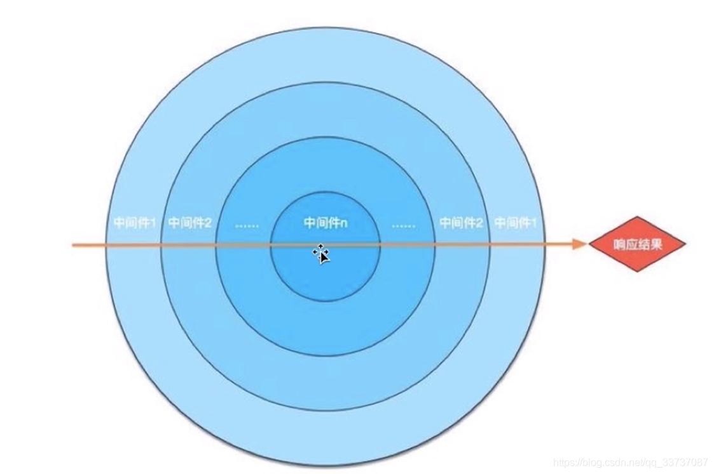

Koa 中间件的使用也是很简单，直接用 `use` 就可以使用中间件了。

看个例子： 

```javascript
const Koa = require('koa')
// 创建实例
const app = new Koa()

// 中间件
const middle1 = async (ctx, next) => {
  console.log('middle1')
  await next()
  console.log('middle1 end')
}
// 中间件
const middle2 = async (ctx, next) => {
  console.log('middle2')
  await next()
  console.log('middle2 end')
}
// 中间件
const middle3 = async (ctx, next) => {
  console.log('middle3')
  await next()
  console.log('middle3 end')
}
// 使用中间件
app.use(middle1)
app.use(middle2)
app.use(middle3)

// 响应
app.use((ctx, next) => {
  ctx.body = 'middle'
})

// 监听端口
app.listen(9527, () => {
  console.log('start server at 9527')
})
```

当发起一个请求的时候，打印的顺序是

```text
middle1
middle2    
middle3    
middle3 end
middle2 end
middle1 end
```

造成这个打印顺序的原因是，中间件机制是个 **洋葱环**



洋葱环，很好理解吧，一层一层的进入，然后再一层一层的出去。

如果洋葱圈你不好理解，你就理解为是函数嵌套：

```javascript

// 执行 middle1
;(function middle1() {
  console.log('middle1')

  // 进入 middle2
  ;(function middle2() {
    console.log('middle2')

    // 进入 middle3
    ;(function middle3() {
      console.log('middle3')
      console.log('middle3 end')
      // middle3 结束 往外走
    })()

    // 出来 middle2 执行结束
    console.log('middle2 end')
  })()

  // 出来 middle1 执行结束
  console.log('middle1 end')
})()

// middle1
// middle2
// middle3
// middle3 end
// middle2 end
// middle1 end
```

大概就是这么个意思，需要了解的是，如果需要往下走，需要执行 `next()`, 也就是说， `next()` 之后的代码，是会等出来的时候再执行的。

那洋葱圈一层一层走，那肯定可以通过 `ctx` 对象来传递和携带一些参数，`bodyparse` 也就是这么做的。

```javascript
const Koa = require('koa')
// 创建实例
const app = new Koa()

// 中间件
const middle1 = async (ctx, next) => {
  console.log('middle1')

  // 传递参数
  ctx.middleMsg = 'middle1 *** '

  await next()
  console.log('middle1 end')
}
// 中间件
const middle2 = async (ctx, next) => {
  console.log('middle2')

  // 传递参数
  ctx.middleMsg += 'middle2 *** '

  await next()
  console.log('middle2 end')
}
// 中间件
const middle3 = async (ctx, next) => {
  console.log('middle3')

  // 传递参数
  ctx.middleMsg += 'middle3 *** '

  await next()
  console.log('middle3 end')
}

app.use(middle1)
app.use(middle2)
app.use(middle3)

// 响应
app.use((ctx, next) => {

  console.log(ctx.middleMsg)
  // middle1 *** middle2 *** middle3 *** 

  ctx.body = 'middle'
})


// 监听端口
app.listen(9527, () => {
  console.log('start server at 9527')
})
```

再实际开发中，利用中间件 **洋葱圈** 的特性来打印日志：

```javascript
// logger
app.use(async (ctx, next) => {
  // 再处理接口之前使用 记录请求进来的时间
  const start = new Date()
  await next()
  const ms = new Date() - start
  // 接口处理完成的时候 出来了 再次记录时间，就可以知道当前接口的请求耗时了
  console.log(`${ctx.method} ${ctx.url} - ${ms}ms`)
})
```
