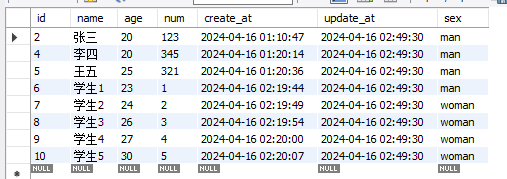
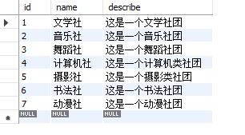
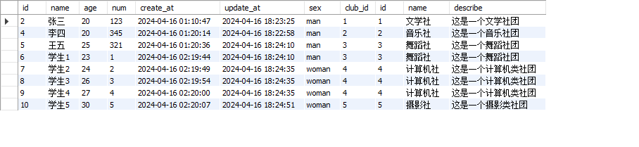
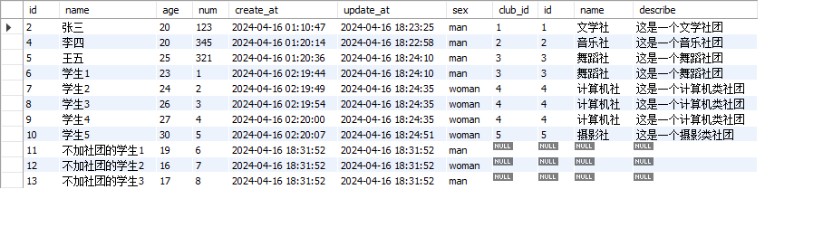
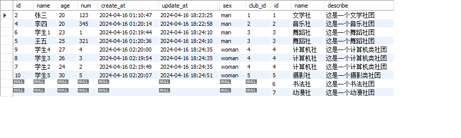
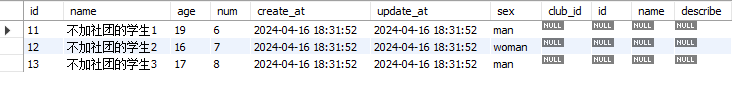
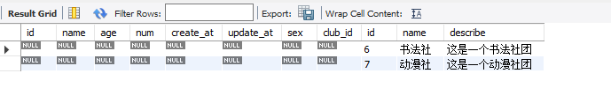

例如，当前我有一个班级学生表。



还有一个社团表



班级学生表，关联到社团表，表示当前这个学生加入了什么社团。

## 外键约束

**class_a** 表添加一个外键 **club_id**，关联到 **club** 表的 **id**

```shell
alter table class_a add club_id int;
alter table class_a add constraint club_id foreign key (club_id) references club(id) on update cascade on delete cascade;
```
`on update cascade` `on delete cascade` 表示，外键关联在更新和删除的时候，是否有相应操作。如果不需要可以不加，使用默认值。

`cascade` 表示需要变化。 `restrict` 表示不可变。

如果你想在创建表的时候，就添加外键, 拿 **class_a** 为例：

```shell
create table if not exists class_a(
 # 其他的一些字段设置
 club_id int,
 foreign key (club_id) references club(id)
);
```

同样的，更新和删除时的操作，如果需要同步，可以添加相应的设置。 `on update cascade` `on delete cascade`


## 连表查询 SQL JOIN

这里把 **class_a** 当做 A 表， **club** 当作 B 表。

### 内连接 inner join

查询两表相交的数据。 

简单来说就是，查出的数据是 **class_a** 里面 **club_id** 不为空的数据。

```shell
select * from class_a inner join club on class_a.club_id = club.id;
```



### 左连接 left join

`left join` 查询 A 表中所有数据，以及和 B 表中相交的部分。

```shell
select * from class_a left join club on class_a.club_id = club.id;
```



### 右连接 right join

`right join` 查询 B 表中的所有数据，以及和 A 表中相交的部分。

```shell
select * from class_a right join club on class_a.club_id = club.id;
```




### 查询独有的数据

查询 A 表中独有的数据，就是与 B 表不相交的数据，通过左连接添加条件 `where club.id is null`

```shell
select * from class_a left join club on class_a.club_id = club.id where club.id is null;
```



相反，查询 B 表独有数据也一样，通过右连接加条件:

```shell
select * from class_a right join club on class_a.club_id = club.id where class_a.club_id is null;
```




到此基本常用的查询都介绍的差不多了。可能最常用的就是左连接了，查询 A 表的时候，通过外键查询到相关的数据一起返回。

