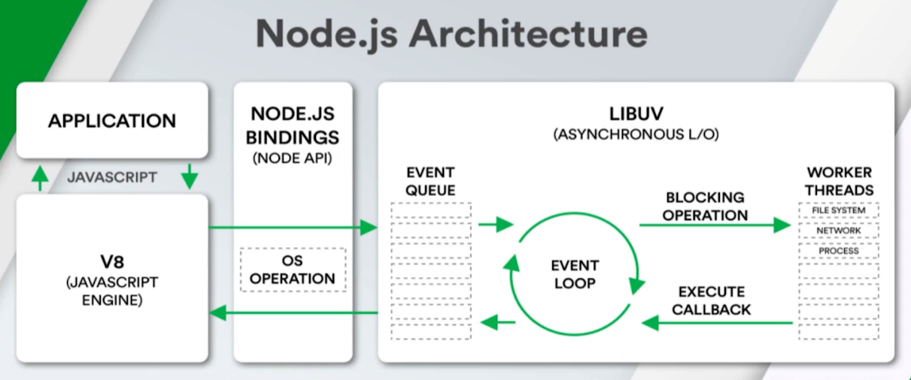

Nodejs 是一个开源的，跨平台的 Javascript 运行时环境。

目前 Nodejs 学习的主要目的，一般是做工程化或者后端服务。

在 nodejs 中，我们所写的 js 代码，会经过映射绑定，再由 V8 引擎解析。

通俗点讲就是，当我们使用 `fs` `child_process` 这种功能的时候，会经过映射和绑定到对应的 `C++` 模块中。
从而使我们能通过 js api 来实现操作系统的功能。

并且 Nodejs 提供了 LIBUV , 可以看作是一个基础库。里面有提供了比如异步的I/O，进程、线程的功能等，并且抹平了各平台的差异。
