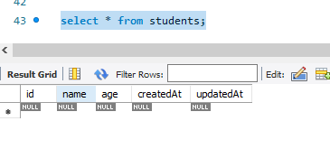
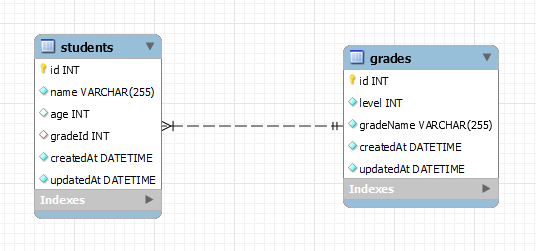

## 连接数据库

安装好之后，数据库的连接也是非常的简单：

```javascript
const { Sequelize } = require('sequelize')

/**
 * @ database 数据库名称
 * @ user 用户名
 * @ password 密码
 */
const seq = new Sequelize('school', 'root', 'long2375', {
  host: 'localhost', // 主机名
  dialect: 'mysql', // 数据库类型
  dialectOptions: {
    dateStrings: true, // 日期类型作为字符串返回
    typeCast: true
  },
  // 北京时间：UTC + 8 时区设置
  timezone: '+08:00',
  // 如果是线上环境 建议使用连接池
  pool: {
    max: 5, // 连接池中最大的连接数量
    min: 0, // 最小
    idle: 10000  // 如果一个连接池 10 s 之内没有被使用，则释放
  }
})

// 测试连接
seq.authenticate().then(res => {
  console.log('测试连接成功！')
}).catch(err => {
  console.log(err)
})

// 测试连接成功

// 导出
module.exports = seq
```

## 创建模型

`sequelize` 创建模型的时候，会自动给表名添加复数，比如 `user` 表名再数据库中创建的表名为 `users` 。

模型需要导出，进行数据查询的时候，需要使用模型的实例进行查询。

模型会自动创建 `id` 并且设置为主键，自增。`create_at` `update_at` 都会被自动创建出来。

```javascript
const { DataTypes} = require('sequelize')
// 引入创建好的 sequelize 实例
const seq = require('./seq')

// 创建 Student 模型，数据库表名为 students
const Students = seq.define(
    'students',
    // id 会自动创建，并且设为主键，自增
    // 并且会自动创建 create_at update_at
    {
      name: {
        type: DataTypes.STRING, // varchar(255)
        allowNull: false, // 是否允许为空 false => 不允许为空
        comment: '学生姓名' // 注释、描述
      },
      age: {
        type: DataTypes.INTEGER,
        allowNull: true, // 是否允许为空 true => 允许为空
        comment: '学生年龄' // 注释、描述
      }
    },
    {
      // seq 会自动创建复数名称，这个属性是为了不使用复数名称
      freezeTableName: true
    }
)

// 导出 model
module.exports = {
  Students
}
```

接着，同步模型到数据库，创建一个同步代码文件 `sync.js`

```javascript
// 引入 sequelize 实例
const seq = require('./seq')
// 引入刚刚创建的模型
require('./model')

// 测试连接
seq.authenticate().then(() => {
  console.log('auth ok')
}).catch(() => {
  console.log('auth err')
})

// 执行同步
seq.sync({ force: true }).then(() => {
  console.log('sync ok')
  process.exit()
})
```

此时，数据库被同步，会创建 `students` 表：



## 创建关联

创建关联很简单，使用 `belongsTo` API ：

```javascript
const { DataTypes} = require('sequelize')
// 引入创建好的 sequelize 实例
const seq = require('./seq')

// 创建 Student 模型，数据库表名为 students
const Students = seq.define(
    'students',
    // id 会自动创建，并且设为主键，自增
    // 并且会自动创建 create_at update_at
    {
      name: {
        type: DataTypes.STRING, // varchar(255)
        allowNull: false, // 是否允许为空 false => 不允许为空
        comment: '学生姓名' // 注释、描述
      },
      age: {
        type: DataTypes.INTEGER,
        allowNull: true, // 是否允许为空 true => 允许为空
        comment: '学生年龄' // 注释、描述
      },
      // 创建年级 id 字段，用于关联年级表
      gradeId: {
        type: DataTypes.INTEGER,
        allowNull: true
      }
    },
    {
      // seq 会自动创建复数名称，这个属性是为了不使用复数名称
      freezeTableName: true
    }
)

// 创建年纪表
const Grades = seq.define(
    'grades',
    {
      level: {
        type: DataTypes.INTEGER,
        allowNull: false
      },
      gradeName: {
        type: DataTypes.STRING,
        allowNull: false
      }
    },
    {
      freezeTableName: true
    }
)

Students.belongsTo(Grades, {
  foreignKey: 'gradeId'
})

// 或者使用这种方式
// Grades.hasMany(Students, {
//   foreignKey: 'gradeId'
// })

// 导出 model
module.exports = {
  Students,
  Grades
}
```



此时，外键关联已经成功了。
