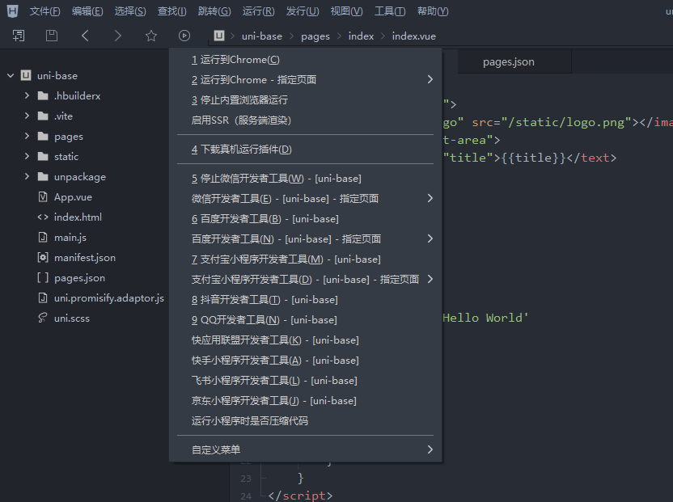
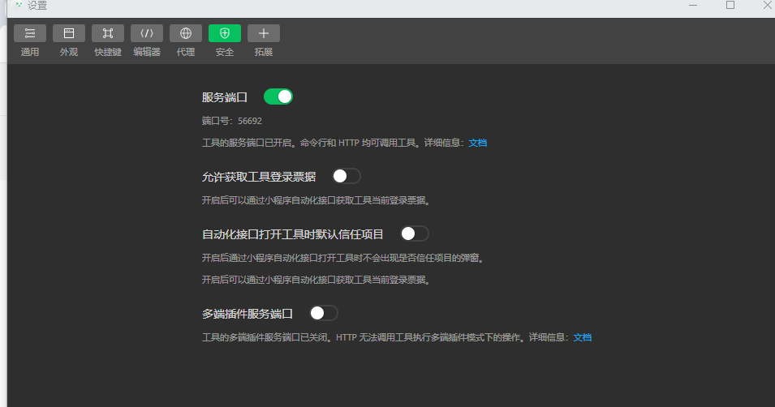

## 使用 HBuilderX 创建

首先去官网下载 [HBuilderX](https://www.dcloud.io/hbuilderx.html) 工具。

[uni 文档](https://uniapp.dcloud.net.cn/)

[创建项目](https://uniapp.dcloud.net.cn/quickstart-hx.html)

运行项目：

如果需要运行到微信开发者工具，需要先下载 [微信开发者工具](https://developers.weixin.qq.com/miniprogram/dev/devtools/download.html)，并且打开工具的服务端口设置。

设置 > 安全 > 服务端口（打开）

#### 发布

发布应用需要有小程序 AppId 和 DClound 的 AppId。
