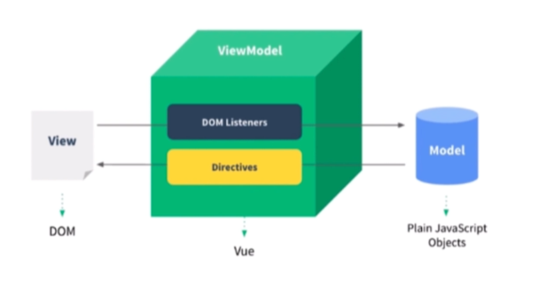

## 数据驱动视图

Vue - MVVM 是通过数据驱动视图.

当需要更新 DOM 的时候, 不需要去直接操作 DOM, 只需要更改数据即可. Vue 框架内提供了根据数据去更新视图的功能.
更加需要关心的是业务数据.

所以 MVVM 应该是 Model, View, ViewModel

再早期开发 web 的时候, 后端使用 jsp 渲染, 返回的是一个 html 页面, 如果需要其他的一些操作,
例如点击一个按钮的出现的交互, 可能都需要手动的去操作 DOM, 所以以前 JQuery 是非常的火的.

JSP 里面也有类似组件化的概念, 可以引入一个组件模块, 在渲染之前, 一样可以通过 el 表达式来进行条件判断 DOM 是否渲染等, 但是当渲染完成之后返回到前端,
就无法通过更改数据的形式操作 DOM 了, 因为已经渲染称为一个 html 文件了, 此时就只能手动的操作 DOM .

但是 vue 框架的 MVVM 直接通过数据去驱动视图, 和以前的组件化有本质的区别的.
