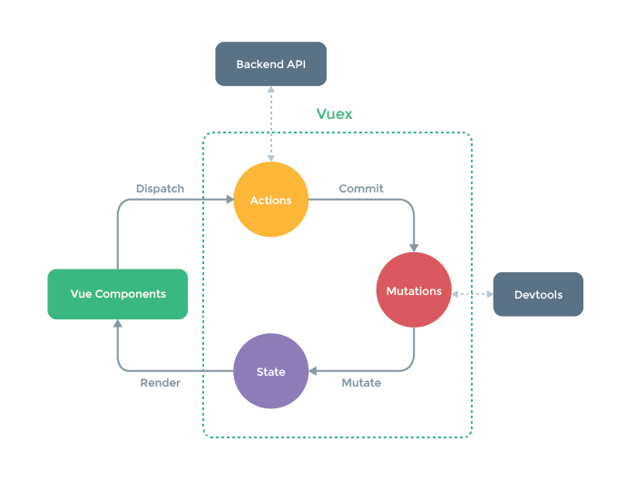

Vuex 是一个专为 Vue.js 应用程序开发的状态管理模式 + 库。

## 基本概念

- state: 状态, 简单理解就是, 需要存储的状态
- Getter: 从 store 中的 state 中派生出一些状态. 可以通过 getter 对数据进行处理后返回.
- Mutation: 更改 Vuex 的 store 中的状态的唯一方法是提交 mutation.
- Action: Action 类似于 mutation，不同在于Action 提交的是 mutation，而不是直接变更状态。Action 可以包含任意异步操作。

> [!tip]
> Mutation 必须是同步的, 至于为什么可以看 [官网介绍](https://vuex.vuejs.org/zh/guide/mutations.html#mutation-%E5%BF%85%E9%A1%BB%E6%98%AF%E5%90%8C%E6%AD%A5%E5%87%BD%E6%95%B0)
> 
> Action 里面可以处理异步, 并且里面是提交一个 Mutation, 不会直接更改 state

## 组件中使用

- `dispatch`
- `commit`
- `mapState`
- `mapGetters`
- `mapActions`
- `mapMutations`
