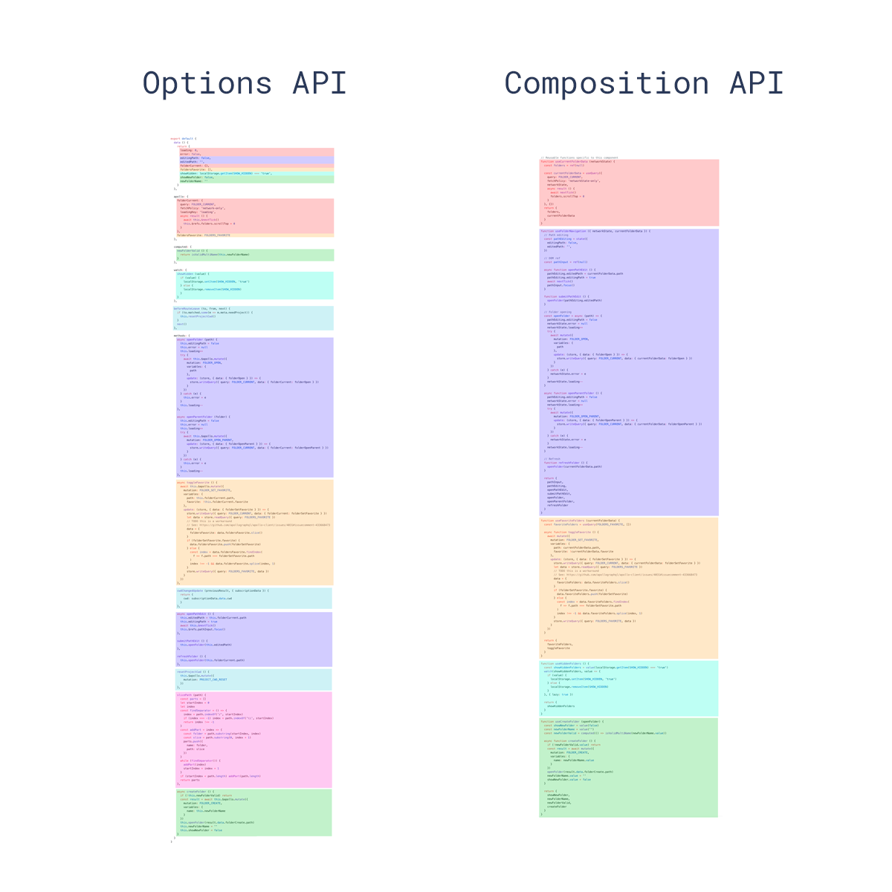

## Composition API 带来了什么

- 更好的代码组织
- 更好的逻辑复用
- 更好的类型推导

### 更好的代码组织

看官方的图:

Composition API 可以让我们把一个功能的逻辑写在一起, 代码看起来更容易的维护.

### 更好的逻辑复用

Composition API 可以把公用的功能抽离出来, 也就是新的 hooks 概念

## 如何选择 Composition API 和 Options API

- 可以共用, 但是不建议共用, 官网也是不建议共用
- 小型项目, 逻辑简单, 直接用 Options API
- 大型项目, 业务复杂, 使用 Composition API, 便于维护, 逻辑清晰, 使用 hooks 代码复用率高

## 别误解 Composition API

Composition API 在文档中的定位是位于进阶的部分, 和深入响应式原理放在一起的, 是为了解决复杂业务逻辑而设计的.

并且官网也说了, 不会放弃 Options API, 选项式 API 也是 Vue 不可分割的一部分, 组合式 API 更适用于大型的项目，而对于中小型项目来说选项式 API 仍然是一个不错的选择。

所以 Composition API 和 Options API 具体怎么选择, 还是需要看具体的使用场景.

