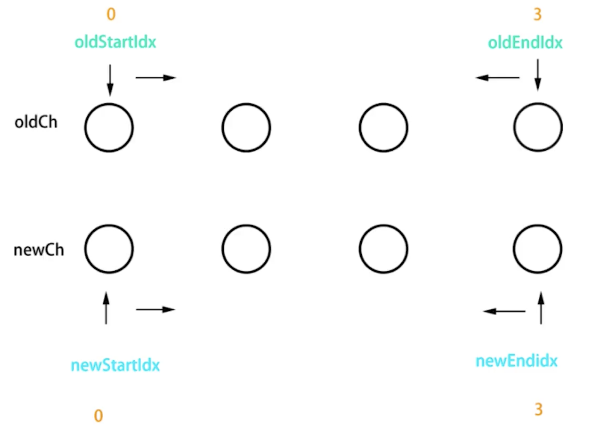

diff 算法是一个对比的过程，是一个广泛的概念；在计算机领域中，diff 算法用于比较两个东西的差异，比如两个文本文件的差异，两个对象属性的差异，两个 DOM 树的差异等。

在 Vue 中，diff 算法用于比较新旧虚拟 DOM 树的差异，从而确定如何高效地更新 DOM。

## diff 算法的基本思路

1. 不跨级比较，同级和同级比较
2. 如果节点的标签类型不同，认为是不同的节点，直接删除重建。
3. 如果节点的标签类型相同，并且 key 也相同，认为是相同的节点，则进行深度比较，递归比较子节点。


### 比较vnode

1. 对比节点类型，如果类型不同，直接替换, 类似这样

```js 

// 是不是相同的 vnode 
if (sameVnode(oldVnode, vnode)) {
  // 是的话，进行深度比较
  patchVnode(oldVnode, vnode)
} else {
  // 不是的话，直接替换
  const oldEl = oldVnode.el
  const parentEl = oldEl.parentNode
  // 直接创建新的节点
  createElm(vnode, parentEl, oldEl)
  // 移除旧的节点
  removeVnodes(parentEl, [oldVnode], 0, 0)
}

```

这里 `sameVnode` 里面就是判断两个节点是不是相同的节点，主要判断了两个节点的标签名和 key 是否相同。

```js
function sameVnode (oldVnode, vnode) {
    return oldVnode.sel === vnode.sel && oldVnode.key === vnode.key
}
```

2. 深度比较 `patchVnode`，这个方法里面会对比新旧节点的属性，子节点，文本节点等。
- 对比 `text`，如果新旧节点的 `text` 不同，直接替换。
- 对比 `children`，如果新旧节点的 `children` 不同，会根据 `children` 的类型进行不同的处理。
- 如果 `children` 是数组，会调用 `updateChildren` 方法进行深度比较。
- 如果 `children` 是文本节点，会直接替换。

3. 如果新旧节点的 `children` 是数组，会调用 `updateChildren` 方法进行深度比较。     



`updateChildren` 方法中的对比过程如下：
- 新旧节点的开始和开始对比
- 新旧节点的结束和结束对比
- 旧节点的开始 和 新节点的结束对比
- 旧节点的结束 和 新节点的开始对比
- 如果都没有匹配上的节点，会根据 key 找到对应的节点进行对比

类似这样

```js 
// 新旧节点的开始和开始对比
if (sameVnode(oldStartVnode, newStartVnode)) {
  patchVnode(oldStartVnode, newStartVnode)
  oldStartVnode = oldCh[++oldStartIdx]
  newStartVnode = newCh[++newStartIdx]
} else 
// 新旧节点的结束和结束对比
if (sameVnode(oldEndVnode, newEndVnode)) {
  patchVnode(oldEndVnode, newEndVnode)
  oldEndVnode = oldCh[--oldEndIdx]
  newEndVnode = newCh[--newEndIdx]
}
// else if  ... 进行后续的的判断
// 如果都没有命中，会拿新节点的key 去旧节点里面找，如果找到，会进行对比
// 如果新节点的key和tag都匹配，旧会进入到 patchVnode 方法去更新属性和深度比较，如果没有找到，会创建新的节点
```

新旧节点分别使用两个指针，从头开始和从结束开始移动，如果重合了，说明对比完成了。