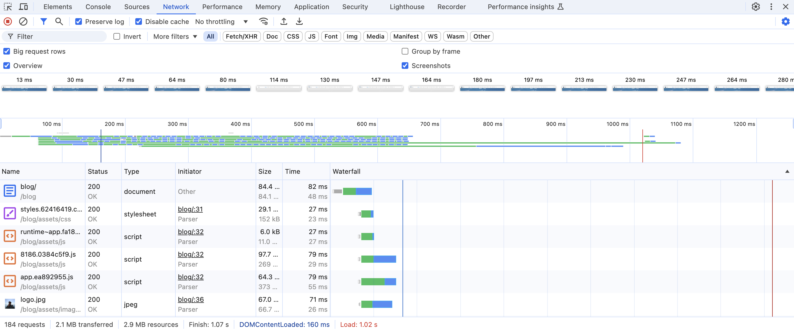
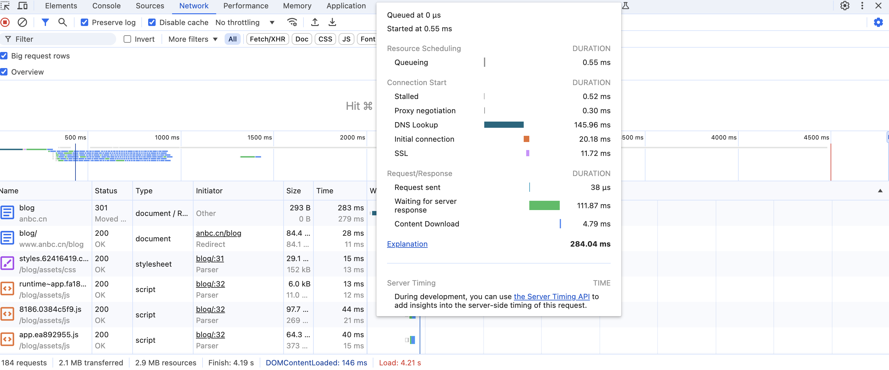
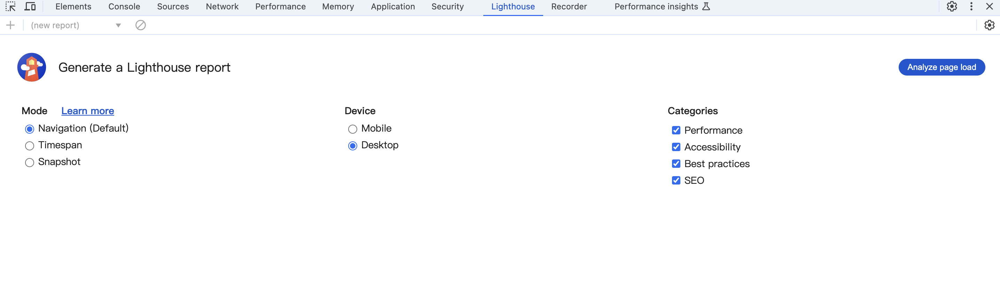
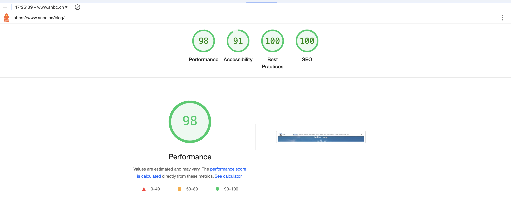
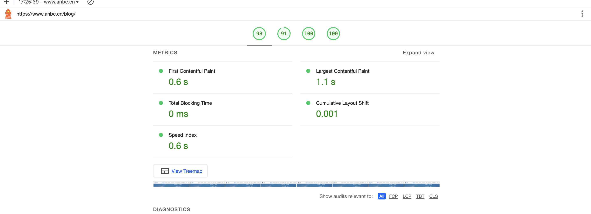
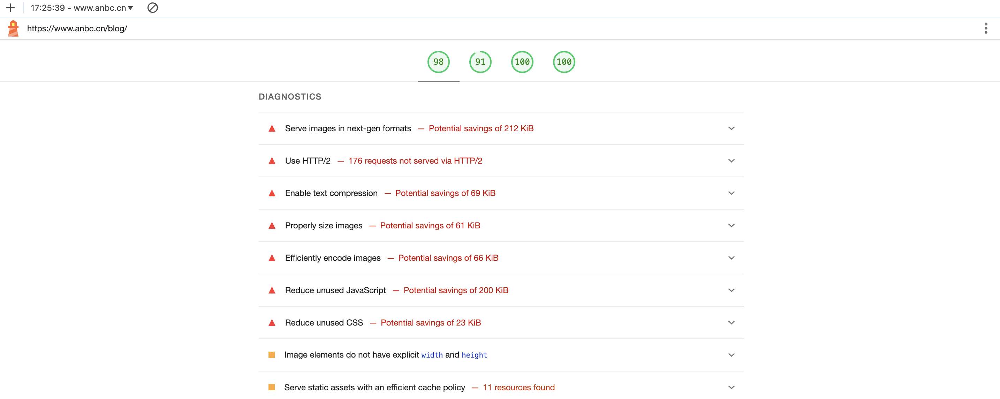
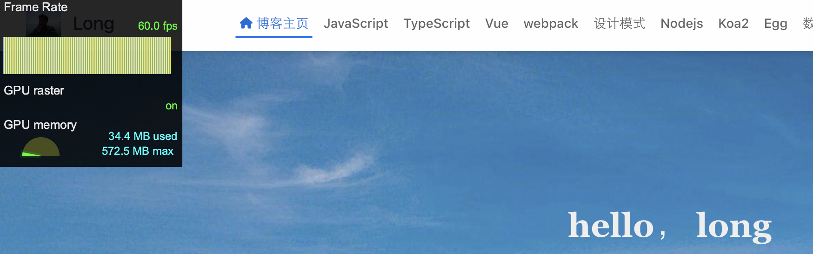

## network
首先就是请求，谷歌浏览器自带的开发者工具，可以查看请求，查看请求的耗时等等。

首先就是打开谷歌的开发者工具，进入 network 选项卡，可以看见请求的一个**瀑布图**。

以本博客为例：

这张图，有几个重要的信息

### 总览

首先是最下方，有请求数，请求资源的大小，完成耗时，DOM渲染出现的时间，以及加载完成的时间。

### 瀑布图

其次就是各种资源的一个请求列表了，这个列表的请求从上往下滑动，可以看见是类似一个瀑布一样的，所以很多人称它瀑布图。
鼠标放上去，可以看见请求的详细信息：

从这种图可以看出来，资源加载的流程，和耗时。

* Queueing：请求在队列中等待的时间。请求都是需要排队的，如果有很多请求，那么请求就会在队列中等待，等待前面的请求完成，才能进行请求。
* Stalled：请求等待发送的时间。这个时间包括了 Queueing 时间，以及等待浏览器准备好可以发送请求的时间。
* Proxy negotiation：浏览器与代理服务器进行协商的时间。
* DNS lookup：浏览器解析域名的时间。
* Initial connection：浏览器与服务器建立连接的时间。
* SSL: 浏览器与服务器建立安全连接的时间。
* Request sent：浏览器发送请求的时间。
* Waiting (TTFB)：浏览器等待服务器响应的时间。这个时间包括了服务器处理请求的时间，以及服务器响应的时间。
* Content Download：浏览器下载响应内容的时间。

在知道这些信息后，从上到下分析

1. 首先就是排队，资源的请求需要排队的，所以有时候前面的请求耗时很长的话，就可能会影响到后面的请求。所以，如果发现排队时间很长，那么就需要优化一下请求，减少请求的数量，或者优化请求的顺序。      
2. 资源的请求是域名，所以拿到域名后会去DNS解析，找到主机ip, 解析域名需要时间，所以如果发现 DNS lookup 时间很长，那么就需要优化一下 DNS 解析，减少 DNS 解析的时间。
3. 和服务器建立连接，包括如果使用了 https 协议，还会有 SSL 安全验证的时间，俗称 SSL 协商，这些都有耗时。
4. 请求发送，这个时间才是浏览器真正发送请求的时间节点。
5. Waiting (TTFB)，这个是最重要，最能体现服务器性能的一个时间，如果这个时间很长，那么说明服务器返回资源的时间很长，所以需要优化一下服务器，减少服务器处理请求的时间。
6. Content Download，这个时间就是浏览器下载资源的时间，如果这个时间很长，那么说明资源很大，所以需要优化一下资源，进行压缩之类的处理。

### 页面渲染

还有一个可以大概看出页面渲染的情况

从这里可以看出，时间节点上页面的渲染情况。对h5优化首页白屏可以作为一个参考。

## lighthouse

谷歌浏览器自带的开发者工具，还有一个 lighthouse 的功能，可以测试页面的性能，包括加载时间，性能，SEO，可访问性等等。

这里没什么好说，根据要测试的 web应用选择对应的端就行，当然这个报告能够作为一个参考，但是不能作为唯一的指标，因为不同的测试结果，可能因为测试环境，测试时间，测试网络等等原因，导致测试结果不一样。

这里也是以本博客为例，测试结果如下：

    

这个报告，也有很多信息可以进行参考，包括首屏加载的速度，每个节点的截图等等都有。可以自己对自己的应用试试，自行查看各项指标。

当然，也会给一些诊断的报告，可以参考一下，进行优化。

## 监测帧数

如果说有做动画较多，或者做各种3D效果的，可以通过谷歌浏览器的开发者工具，监测帧数，看帧数是否稳定。

大概就是这么个东西，当然卡不卡的，理论上说60帧每秒，人眼才不会感觉到卡顿，所以帧数稳定在60帧每秒，就说明动画效果是不错的。

调出来这个帧数监测的方法：

* 快捷键：**command + shift + p**, 调出命令面板，输入 `frame` 选择 `Show frames per second (fps) meter`，就可以调出来帧数监测了。

不是 mac 的话，转换一下对应的键即可。