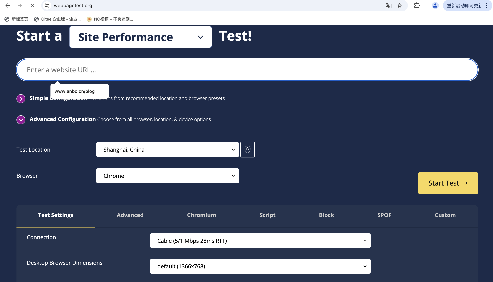
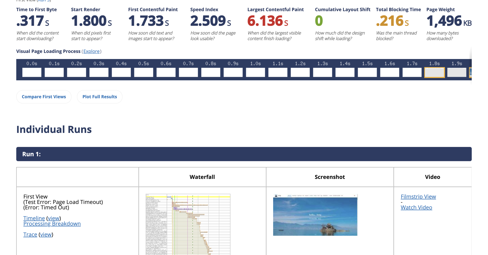

# WebPageTest 在线测试介绍

WebPageTest 是一个在线的网页性能测试工具，可以帮助开发者了解网页的性能，并找到性能瓶颈。WebPageTest 可以测试网页的加载时间、交互时间、动画时间和空闲时间，并给出详细的性能报告。

最主要的是，WebPageTest 可以选择全球不同节点的不同浏览器，不同的网络环境进行测试。这对有海外业务的应用来说，是非常方便的。

## WebPageTest 的特点

1. **跨平台**：WebPageTest 支持在 Windows、Mac 和 Linux 上运行。
2. **跨浏览器**：WebPageTest 支持在 Chrome、Firefox、Safari 和 Internet Explorer 上运行。
3. **跨设备**：WebPageTest 支持在桌面、平板和手机上运行。
4. **跨网络**：WebPageTest 支持在 3G、4G 和 Wi-Fi 网络上运行。
5. **详细的性能报告**：WebPageTest 提供详细的性能报告，包括加载时间、交互时间、动画时间和空闲时间，以及每个请求的详细信息。

## 如何使用 WebPageTest

1. 打开 WebPageTest 网站（https://www.webpagetest.org/）。
2. 在输入框中输入要测试的网页 URL。
3. 选择测试的设备和网络条件。
4. 点击 "Start Test" 按钮，开始测试。
5. 等待测试完成，查看性能报告。

## 查看报告

WebPageTest 的性能报告包括以下部分：

如果没有进行额外配置，那么默认会有三次的测试报告。

这里面有总览，也可以查看每一次测试的详细报告。

包括首次的加载、渲染时间等等，请求的瀑布图，以及每个请求的详细信息。