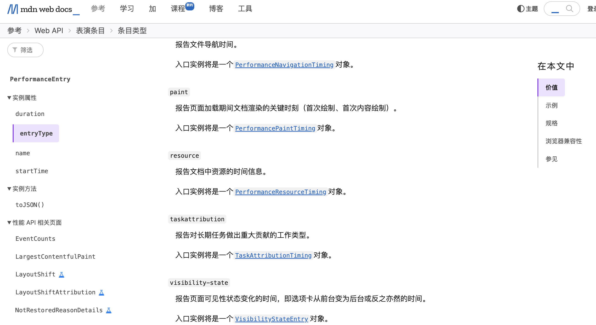
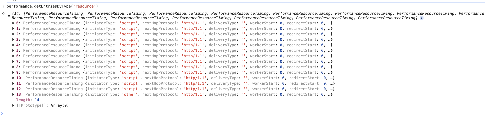

在开发web应用的时候，例如我们需要进行前端性能监控，那么我们就可以通过浏览器提供的一些性能信息API来获取到页面的性能数据，从而进行性能优化，或者上报到服务器。

## Performance

`Performance` 接口可以获取到当前页面与性能相关的信息。

通过查阅 MDN 文档可以看见，`Performance` 接口有很多属性，这些属性可以获取到与性能相关的信息，如：



实际使用：



那么通过 `Performance` 对象，例如算一个页面的可交互时间：

```js 
const timing = performance.getEntriesByType('navigation')[0]
const tti = timing.domInteractive - timing.fetchStart
console.log(tti)
// 107.5  单位毫秒
```

更多的时间计算：

* DNS 解析耗时: domainLookupEnd - domainLookupStart
* TCP 连接耗时: connectEnd - connectStart
* SSL 安全连接耗时: connectEnd - secureConnectionStart
* 网络请求耗时 (TTFB): responseStart - requestStart
* 数据传输耗时: responseEnd - responseStart
* DOM 解析耗时: domInteractive - responseEnd
* 资源加载耗时: loadEventStart - domContentLoadedEventEnd
* First Byte时间: responseStart - domainLookupStart
* 白屏时间: responseEnd - fetchStart
* 首次可交互时间: domInteractive - fetchStart
* DOM Ready 时间: domContentLoadEventEnd - fetchStart
* 页面完全加载时间: loadEventStart - fetchStart
* http 头部大小： transferSize - encodedBodySize
* 重定向次数：performance.navigation.redirectCount
* 重定向耗时: redirectEnd - redirectStart


## PerformanceObserver

`PerformanceObserver` 接口可以用来监测性能条目的变化，例如监测 `longtask`:

```js 
var observer = new PerformanceObserver(list => {
    for (const entry of list.getEntries()) {
        console.log(entry)
    }
})

observer.observe({entryType: ['longtask']})
```

更多属性：

* entryType: 条目类型，例如 `longtask`、`paint`、`measure` 等
* buffered: 是否缓冲了条目，如果为 `true`，则表示条目已经被缓冲，可以通过 `getEntries()` 方法获取到所有条目
* observer: 监测器对象，可以通过 `disconnect()` 方法停止监测

当然如果需要更多的功能，可以参照 MDN 文档。


## 监测用户当前是否在浏览页面

通过 `visibilitychange` 事件可以监测用户当前是否在浏览页面，例如：

```js 
let eventName = 'visibilitychange'
if (document.webkitHidden !== undefined) {
  eventName = 'webkitvisibilitychange'
}

function visibilityChanged() {
  if (document.hidden || document.webkitHidden) {
    console.log('没有在看页面，切出去了')
  } else {
    console.log('回来了')
  }
}

document.addEventListener(eventName, visibilityChanged)
```

当如果有一些动画，或者直播流的时候，也许你想在用户切换出去的时候截流，或者停止动画的渲染，可以用这个 API 来实现监测用户是否停留在当前的页面。

或者在前端监控里面，可以上报服务器，告知用户是否在浏览页面，从而进行一些统计。