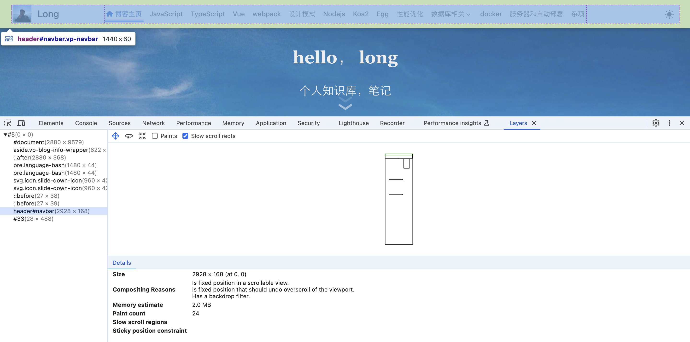

## 复合和图层

浏览器渲染复合（Composite）和图层（Layer）是浏览器渲染网页的两个重要过程。它们直接影响网页的加载速度和性能。本文将介绍浏览器渲染复合和图层的概念、原因和优化方法。

可以理解为，类似 PS 一样，不同的元素，会分成不同的图层，最后再合成一个页面来展示，类似 UI 的设计稿一样的。



当使用 `transform` `opacity` 这些属性进行变更的时候，就只会触发复合，而不会触发回流和重绘。


## 回流

回流，有的人也叫布局，它只关心元素的大小和位置，用于计算元素在设备视口内的确切位置和大小。

### 影响回流的操作

* 添加、删除元素。
* 移动元素位置。
* 修改元素的宽高、填充、边距、边框，字体大小等。
* 修改窗口大小。
* 读取一些属性：offsetWidth、offsetHeight、clientWidth、clientHeight、scrollTop、scrollLeft、getComputedStyle、getBoundingClientRect等。

总的来说，影响回流的操作，就是涉及到元素布局的，都会产生回流。

> [!warning]
> 关于回流，有一个编码陷阱就是，当你实时的去读取例如 `offsetTop` 这种属性的时候，会不断的去触发强制回流，从而影响性能。

### fastdom

fastdom 是一个库，它将多次回流和重绘的操作，合并成一次，从而减少回流和重绘的次数。

虽然现在都是 vue react 时代，他们都用了虚拟dom在某一个节点去批量的更新重绘dom，但是如果优化老项目，例如jquery 为主的项目，或者 jsp 这种老项目，就能派上用场了。

## 重绘

重绘，绘制，就是把节点像素化，用于将渲染树中的每个节点转换成屏幕上的实际像素。

利用 Chrome DevTools 的 Rendering 面板，可以查看页面重绘的情况。

`command + shift + p` 打开快捷指令，输入 `Rendering`，选择 `Paint flashing`，就可以实时的看到重绘的情况。

### 利用复合减少重绘

使用 `transform` `opacity` 属性进行变更的时候，就只会触发复合，而不会触发回流和重绘。

那么在复合和图层的概念中得知，浏览器会把一些元素，单独的分成一个图层，然后进行复合，那么我们就可以通过 `will-change` 来告诉浏览器，这个元素可能会发生回流和重绘，从而提前进行复合，从而减少回流和重绘。

所以当我们对元素一些样动画之类的，尽量使用 `transform` `opacity` 来做，并且可以在元素上添加 `will-change` 属性，来提前进行复合。

```css
/* 将元素分成一个图层 */
will-change: transform, opacity;
```

并且，在做一些动画的时候，特别是高频事件处理，例如 `mousemove`，`scroll`，`resize` 这种事件，尽量使用 `requestAnimationFrame` 来进行节流，从而减少回流和重绘的次数。
