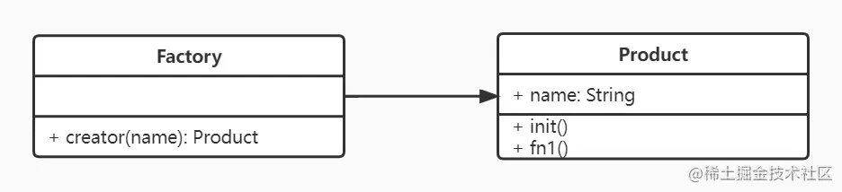

## 工厂模式

> [!tip]
> 将 new 操作单独封装



```javascript
class Product {
  constructor(name) {
    this.name = name;
  }
  init() {
    console.log('init');
  }

  fn1() {
    console.log('fn1');
  }
}
class Factory {
  constructor(name) {
    return new Product(name);
  }
}
const p = new Factory('name');
p.init();
p.fn1();
```

## 设计原则验证

- 构造函数和创建者分离
- 符合开放封闭原则

## 理解

工厂模式就是通过工厂方法，把构造函数（可以理解为具体的实现）和使用者隔离起来。

## 场景

Product 是封装好的构造函数，里面是一些业务或者功能的具体实现，再通过 Factory 工厂方法，把 Product 的实例返回，给使用者使用。
