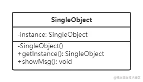

## 单例模式

> [!tip]
>
> - 系统中唯一使用
> - 一个类 只有一个实例



```typescript
class Test {
  private static instance: Test | null = null;
  // 私有化构造函数
  private constructor() {}
  //ts 中 static 用来暴露一个静态属性
  static getInstance(): Test | null {
    if (this.instance === null) {
      this.instance = new Test();
    }
    return this.instance;
  }
  public showMsg(): void {
    console.log('这是一条消息');
  }
}

// const testObj = new Test()
// Constructor of class 'Test' is private and only accessible within the class declaration.
// 类"Test"的构造函数是私有的，只能在类声明中访问。

const testObj = Test.getInstance();
testObj.showMsg();
//这是一条信息
```

## 设计原则验证

- 符合单一职责原则，只实例化唯一的对象
- 没法具体开放封闭原则，但是绝对不违反开放封闭原则

## 理解

字面意思，只能有唯一的一个实例。

## 场景

购物车，vuex store 中的状态管理，模块 A 和 模块 B 在 store 中获取的状态必须是一致的，数据必须是需要能够共享的，这就是单例模式的体现。
