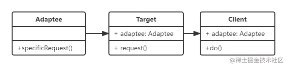

## 适配器模式

> [!tip]
>
> - 旧接口格式和使用者不兼容
> - 中间加一个适配转换接口

列如变压器，电源适配器，电脑网线转换头等。



```javascript
class Adaptee {
  specificRequest() {
    return '这是一个老的接口';
  }
}

class Target {
  constructor() {
    this.adaptee = new Adaptee();
  }

  request() {
    let old = this.adaptee.specificRequest();
    return `我是新接口，给你转老接口的话: ${old}`;
  }
}

const target = new Target();
console.log(target.request());
// 我是新接口，给你转老接口的话: 这是一个老的接口
```

## 设计原则验证

- 将旧接口和使用者进行分离
- 符合开放封闭原则

## 理解

适配器模式，类似电源适配器一样，将 220V 的电压转换成电脑手机能够使用的电压。适配器里可以进行一些处理，最后得到我们想要的东西。

## 场景

一些老方法的改造，列如

```javascript
//公共方法 多处使用
oldAjax.request();

// 全局修改麻烦 可以用适配器重新定义 oldAjax
const oldAjax = {
  request: (params) => {
    return newAlax.request(params);
  },
};
```

这样老的 `oldAjax.request()` 仍然可以使用，但是实际是用的新的 `request` 方法。
