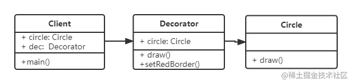

## 装饰器模式

> [!tip]
>
> - 为对象添加新功能
> - 不改变其原有的结构和功能



```javascript
class Circle {
  draw() {
    console.log('画圆');
  }
}

class Decorator {
  constructor(circle) {
    this.circle = circle;
  }
  draw() {
    this.circle.draw();
    this.setRedBorder();
  }
  setRedBorder() {
    console.log('设置红色边框');
  }
}
const circle = new Circle();
circle.draw();
```

关于 ES7 装饰器的详细信息请看 [Decorator 装饰器](../JavaScript/12ES高级特性/2装饰器.md)

## 理解

装饰器模式在不改变原有对象的情况下，去扩展一些功能来满足更加复杂的业务需求。就像给手机装个手机壳，可以保护手机和当支架，但是手机壳仍然会暴露出手机摄像头、充电口、按键，不会覆盖这些手机原有的功能。

## 设计原则验证

- 将现有对象和装饰器进行分离，两者独立存在
- 符合开放封闭原则
