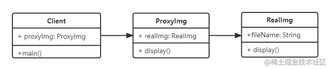

## 代理模式

> [!tip]
>
> - 使用者无权访问对象
> - 中间加代理，通过代理做授权和控制



```javascript
class RealImg {
  constructor(fileName) {
    this.fileName = fileName;
  }
  display() {
    console.log('display:', this.fileName);
  }
}

class ProxyImg {
  constructor(fileName) {
    this.realImg = new RealImg(fileName);
  }
  display() {
    this.realImg.display();
  }
}
const proxyImg = new ProxyImg('未命名文件.png');
proxyImg.display();
//display: 未命名文件.png
```

经典代理模式 [ES6 Proxy](../JavaScript/12ES高级特性/1Proxy.md)

## 理解

使用者在使用目标类的时候，受限于一些权限或者安全问题，不能直接访问，就需要加代理，通过代理去访问。 就类似疫情期间在家里访问公司内网，需要挂 vpn 代理访问。代理的接口或者属性应该和目标类一样，体验上是相同的，比如挂了 vpn 代理，该访问什么地址就是什么地址，不能加了代理之后，访问的地址和接口还变了，那么就不是代理了。

## 设计原则验证

- 代理类和目标类分离，隔离开目标类和使用者
- 符合开放封闭原则

## 场景

网页事件代理，ES6 Proxy， jQuery.proxy

## 代理模式，适配器模式，装饰器模式对比

#### 代理模式 VS 适配器模式

- 适配器模式： 提供一个不同的接口。(使用者可以用，但是因为目标类太老旧或其他原因，不能够直接使用，可以用，但是没法直接用。)
- 代理模式：提供一模一样的接口。(使用者无权使用，但是又想使用，所以要提供一模一样的接口，才能感觉有权使用。)

#### 代理模式 VS 装饰器模式

- 装饰器模式：扩展功能，原有功能不变且可直接使用。(原有的可以用，扩展之后功能增强，扩展的功能和原有功能不冲突。)
- 代理模式：显示原有功能，但是经过限制或者阉割之后的。(直接针对原有功能)
