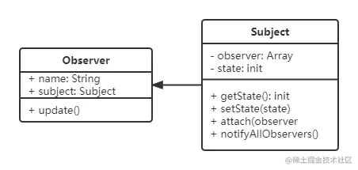

## 观察者模式

> [!tip]
>
> - 发布 & 订阅
> - 一对 n， n 可以等于 1



例如： 订报纸、订牛奶， 到点会有送报员过来送。可以同时订牛奶和报纸。

发布订阅的机制，有能力一对多，不一定是一定要一对多。

```javascript
// 主题 保存状态，状态变化之后触发所有观察者
class Subject {
  constructor() {
    this.state = 0;
    this.observers = [];
  }

  getState() {
    return this.state;
  }

  setState(state) {
    this.state = state;
    this.notifyAllObservers();
  }

  notifyAllObservers() {
    this.observers.forEach((observer) => {
      observer.update();
    });
  }

  attach(observer) {
    this.observers.push(observer);
  }
}

// 观察者
class Observer {
  constructor(name, subject) {
    this.name = name;
    this.subject = subject;
    this.subject.attach(this);
  }

  update() {
    console.log(`${this.name} update, state: ${this.subject.getState()}`);
  }
}

const s = new Subject();
const o1 = new Observer('o1', s);
const o2 = new Observer('o2', s);

s.setState(1);
// o1 update, state: 1
// o2 update, state: 1
```

## 场景

网页事件绑定、promise、nodejs 自定义事件等等

#### 网页事件绑定

绑定事件可以理解为订阅，绑定的方法 = 观察者， 当按钮被点击，会触发所有订阅的观察者。

```html
<button id="btn">点击</button>
<script>
  const btn = document.getElementById('btn');
  btn.addEventListener('click', () => {
    console.log('1');
  });
  btn.addEventListener('click', () => {
    console.log('2');
  });
  // 1
  // 2
</script>
```

观察者模式的场景非常的多，jq 的 callback， vue 的监听和生命周期等等。

## 理解

当前观察者订阅之后，当主题发生变化或者被触发，则会触发所有订阅在它下面的观察者。类似点了咖啡，坐着等就行了，发了取餐消息，就可以去拿。

## 设计原则验证

- 主题和观察者分离，不是主动触发而是被动监听，两者解耦
- 符合开放封闭原则
