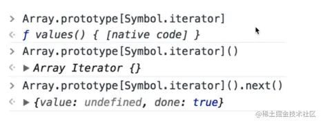

## 迭代器模式

> [!tip]
>
> - 顺序访问一个集合
> - 使用者无需知道集合的内部结构

## ES6 Iterator

- 有 [Symbol.iterator] 属性。属性值是函数，执行函数返回一个迭代器。
- 迭代器有 next 方法顺序迭代子元素。



#### 代码演示

```javascript
const arr = [1, 2, 3];

const m = new Map();
m.set('a', 100);
m.set('b', 200);

function each(data) {
  let iterator = data[Symbol.iterator]();
  let item = { done: false };
  while (!item.done) {
    item = iterator.next();
    if (!item.done) {
      console.log(item.value);
    }
  }
}

each(arr);
// 1
// 2
// 3

each(m);
// [ 'a', 100 ]
// [ 'b', 200 ]
```

但是迭代器不可能需要所有人都去封装一个遍历的方法，因此有了 for...of

```javascript
const arr = [1, 2, 3];

const m = new Map();
m.set('a', 100);
m.set('b', 200);

function each(data) {
  for (let item of data) {
    console.log(item);
  }
}

each(arr);
// 1
// 2
// 3

each(m);
// [ 'a', 100 ]
// [ 'b', 200 ]
```

## 场景

迭代器可以用来顺序遍历 nodeList， map, set 等具有迭代器特性的数据类型。

## 理解

顺序去访问集合，通过迭代器的 next 方法访问下一个子元素，嗯，有点像链表。

## 设计原则验证

- 迭代器对象和目标对象分离
- 迭代器将使用者和目标对象隔开
- 符合开放封闭原则
