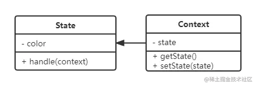

## 状态模式

> [!tip]
>
> - 一个对象有状态变化
> - 每次状态变化都会触发一个逻辑



```javascript
class State {
  constructor(color) {
    this.color = color;
  }

  handler(context) {
    console.log(`改变: ${this.color}`);
    context.setState(this);
  }
}

class Context {
  constructor() {
    this.state = null;
  }

  getState() {
    return this.state;
  }

  setState(state) {
    this.state = state;
  }
}

const ctx = new Context();

const green = new State('green');
const yellow = new State('yellow');

green.handler(ctx);
console.log(ctx.getState());
// 改变: green
// State { color: 'green' }

yellow.handler(ctx);
console.log(ctx.getState());
// 改变: yellow
// State { color: 'yellow' }
```

用 handle 来改变状态，是为了拆开，在 handle 里面可以有其他的逻辑， setState 只是 handle 里面的一部分。

## 场景

Promise 的状态变化。

## 理解

状态机，管理状态，和状态对象分离，状态的变化逻辑单独去处理。

## 设计原则验证

- 将状态对象和主题对象分离，状态的变化逻辑单独处理
- 符合开放封闭原则
